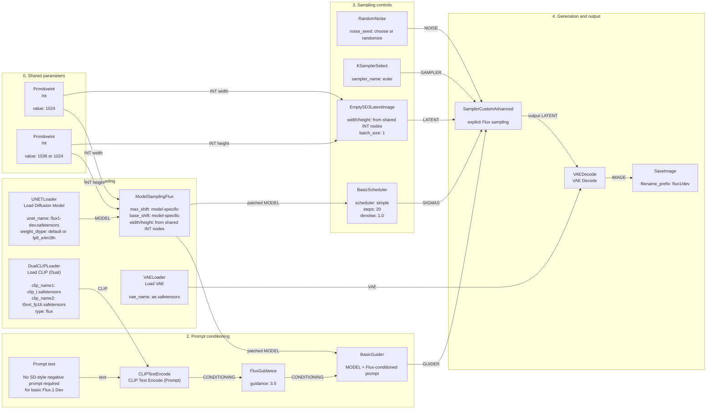
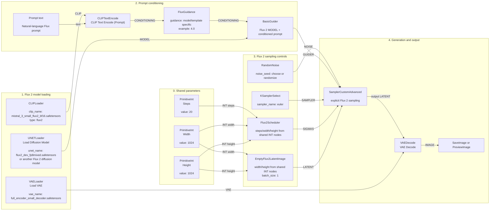
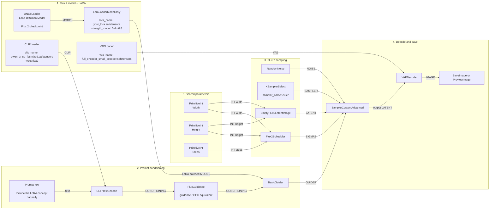

# Full-power FLUX.1 text-to-image workflow for ComfyUI

This is the proper FLUX.1-style text-to-image workflow: separate diffusion model, dual text encoders, explicit Flux guidance, explicit guider/scheduler/sampler stack, VAE decode, and save.

Use this when you want to understand and control FLUX properly. The simpler `KSampler` workflow can run, but it hides the Flux-specific sampling pieces that matter.

## Target model family

This workflow is for local FLUX.1 diffusion models such as:

- `flux1-dev.safetensors`
- `flux1-schnell.safetensors`
- `flux1-krea-dev.safetensors`

For "full power" quality, start with `flux1-dev.safetensors` or `flux1-krea-dev.safetensors`, not the single-file FP8 checkpoint shortcut.

## Required model files

Put the model files here, or expose equivalent folders through `extra_model_paths.yaml`.

```text
ComfyUI/
  models/
    diffusion_models/
      flux1-dev.safetensors

    text_encoders/
      clip_l.safetensors
      t5xxl_fp16.safetensors

    vae/
      ae.safetensors
```

For lower VRAM, replace `t5xxl_fp16.safetensors` with `t5xxl_fp8_e4m3fn.safetensors`. On an RTX 4090, prefer `t5xxl_fp16.safetensors` first.

## Nodes

Use these exact ComfyUI node classes:

| Purpose | Node class | UI display name |
|---|---|---|
| Load Flux diffusion model | `UNETLoader` | `Load Diffusion Model` |
| Load CLIP-L + T5-XXL text encoders | `DualCLIPLoader` | `Load CLIP (Dual)` |
| Patch Flux sampling behavior for resolution | `ModelSamplingFlux` | `ModelSamplingFlux` |
| Encode prompt | `CLIPTextEncode` | `CLIP Text Encode (Prompt)` |
| Apply Flux guidance strength | `FluxGuidance` | `FluxGuidance` |
| Convert model + conditioning into a guider | `BasicGuider` | `Basic Guider` |
| Select sampler algorithm | `KSamplerSelect` | `KSamplerSelect` |
| Create step/sigma schedule | `BasicScheduler` | `BasicScheduler` |
| Create noise from seed | `RandomNoise` | `RandomNoise` |
| Create empty Flux latent | `EmptySD3LatentImage` | `EmptySD3LatentImage` |
| Run the explicit sampler | `SamplerCustomAdvanced` | `SamplerCustomAdvanced` |
| Load Flux VAE | `VAELoader` | `Load VAE` |
| Decode latent to pixels | `VAEDecode` | `VAE Decode` |
| Save output | `SaveImage` | `Save Image` |
| Shared width value | `PrimitiveInt` | `Int` |
| Shared height value | `PrimitiveInt` | `Int` |

## High-quality graph diagram



## Exact wiring checklist

Wire the nodes like this:

```text
DualCLIPLoader.CLIP
  -> CLIPTextEncode.clip

Prompt text
  -> CLIPTextEncode.text

CLIPTextEncode.CONDITIONING
  -> FluxGuidance.conditioning

FluxGuidance.CONDITIONING
  -> BasicGuider.conditioning

UNETLoader.MODEL
  -> ModelSamplingFlux.model

PrimitiveInt width.INT
  -> ModelSamplingFlux.width
  -> EmptySD3LatentImage.width

PrimitiveInt height.INT
  -> ModelSamplingFlux.height
  -> EmptySD3LatentImage.height

ModelSamplingFlux.MODEL
  -> BasicGuider.model

ModelSamplingFlux.MODEL
  -> BasicScheduler.model

RandomNoise.NOISE
  -> SamplerCustomAdvanced.noise

BasicGuider.GUIDER
  -> SamplerCustomAdvanced.guider

KSamplerSelect.SAMPLER
  -> SamplerCustomAdvanced.sampler

BasicScheduler.SIGMAS
  -> SamplerCustomAdvanced.sigmas

EmptySD3LatentImage.LATENT
  -> SamplerCustomAdvanced.latent_image

SamplerCustomAdvanced.output
  -> VAEDecode.samples

VAELoader.VAE
  -> VAEDecode.vae

VAEDecode.IMAGE
  -> SaveImage.images
```

## Recommended starting settings for FLUX.1 Dev

```text
UNETLoader:
  unet_name: flux1-dev.safetensors
  weight_dtype: default

PrimitiveInt width:
  value: 1024

PrimitiveInt height:
  value: 1024

ModelSamplingFlux:
  max_shift: use the model creator's recommendation
  base_shift: use the model creator's recommendation
  width: connect from PrimitiveInt width
  height: connect from PrimitiveInt height

DualCLIPLoader:
  clip_name1: clip_l.safetensors
  clip_name2: t5xxl_fp16.safetensors
  type: flux

VAELoader:
  vae_name: ae.safetensors

FluxGuidance:
  guidance: 3.5

BasicScheduler:
  scheduler: simple
  steps: 20
  denoise: 1.0

KSamplerSelect:
  sampler_name: euler

EmptySD3LatentImage:
  width: connect from PrimitiveInt width
  height: connect from PrimitiveInt height
  batch_size: 1

SaveImage:
  filename_prefix: flux1/dev
```

## Notes that matter

- `UNETLoader` is badly named for Flux. In the UI it appears as `Load Diffusion Model`. It loads the main Flux diffusion transformer model, even though Flux is not a classic SD UNet.
- `ModelSamplingFlux` should sit after `UNETLoader` in a full-control Flux graph. Its width/height should match the actual latent width/height.
- Use shared `PrimitiveInt` nodes for width and height. Connect them to both `ModelSamplingFlux` and `EmptySD3LatentImage` so the resolution cannot drift out of sync.
- `FluxGuidance` is the Flux-specific guidance node. For FLUX.1 Dev, `3.5` is a strong default.
- Do not think in SD negative-prompt terms first. Basic Flux.1 text-to-image usually uses one positive prompt plus `FluxGuidance`.
- `SamplerCustomAdvanced` is preferred here because it makes the Flux-native sampler stack explicit: noise, guider, sampler, sigmas, latent.
- `KSampler` can run some Flux workflows, but it hides too much and is not the graph to study if your goal is real understanding.
- The VAE is `ae.safetensors`, not a normal SD VAE.

## Minimal mental model

```text
Flux model -> ModelSamplingFlux + CLIP-L/T5 prompt + FluxGuidance
        -> BasicGuider
        -> SamplerCustomAdvanced with noise/sampler/sigmas/latent
        -> VAE Decode with ae.safetensors
        -> Save Image
```

## Flux 2 text-to-image equivalent workflow

Flux 2 is not a drop-in model swap for this Flux 1 workflow. A Flux 2 text-to-image graph keeps the same high-level idea, but replaces the Flux 1 text encoder, scheduler, latent, and often VAE pieces.

Key changes:

| Flux 1 node | Flux 2 replacement | Why |
|---|---|---|
| `DualCLIPLoader` | `CLIPLoader` | Flux 2 uses a Flux 2 text encoder such as `mistral_3_small_flux2_bf16.safetensors`, not CLIP-L + T5-XXL. |
| `ModelSamplingFlux` | remove | Flux 2 templates use `Flux2Scheduler` instead of the Flux 1 model sampling patch. |
| `BasicScheduler` | `Flux2Scheduler` | Flux 2 has its own sigma/scheduler logic. |
| `EmptySD3LatentImage` | `EmptyFlux2LatentImage` | Flux 2 uses its own latent initialization node. |
| `ae.safetensors` | usually `full_encoder_small_decoder.safetensors` | Flux 2 templates use a different recommended VAE. |

Flux 2 still commonly uses:

- `UNETLoader`
- `CLIPTextEncode`
- `FluxGuidance`
- `BasicGuider`
- `RandomNoise`
- `KSamplerSelect`
- `SamplerCustomAdvanced`
- `VAEDecode`
- `SaveImage` or `PreviewImage`



Flux 2 exact wiring checklist:

```text
CLIPLoader.CLIP
  -> CLIPTextEncode.clip

Prompt text
  -> CLIPTextEncode.text

CLIPTextEncode.CONDITIONING
  -> FluxGuidance.conditioning

FluxGuidance.CONDITIONING
  -> BasicGuider.conditioning

UNETLoader.MODEL
  -> BasicGuider.model

PrimitiveInt steps.INT
  -> Flux2Scheduler.steps

PrimitiveInt width.INT
  -> Flux2Scheduler.width
  -> EmptyFlux2LatentImage.width

PrimitiveInt height.INT
  -> Flux2Scheduler.height
  -> EmptyFlux2LatentImage.height

Flux2Scheduler.SIGMAS
  -> SamplerCustomAdvanced.sigmas

EmptyFlux2LatentImage.LATENT
  -> SamplerCustomAdvanced.latent_image

RandomNoise.NOISE
  -> SamplerCustomAdvanced.noise

KSamplerSelect.SAMPLER
  -> SamplerCustomAdvanced.sampler

BasicGuider.GUIDER
  -> SamplerCustomAdvanced.guider

SamplerCustomAdvanced.output
  -> VAEDecode.samples

VAELoader.VAE
  -> VAEDecode.vae

VAEDecode.IMAGE
  -> SaveImage.images
```

Do not use the Flux 1 `DualCLIPLoader + ModelSamplingFlux + BasicScheduler + EmptySD3LatentImage` stack for Flux 2. Use the Flux 2 stack:

```text
CLIPLoader + Flux2Scheduler + EmptyFlux2LatentImage
```

## Flux 2 text-to-image with LoRA

To add a LoRA to a Flux 2 workflow, put the LoRA loader after the diffusion model loader and before the guider/scheduler uses the model.

For many Flux 2 LoRAs, especially model-only LoRAs, use:

```text
LoraLoaderModelOnly
```

Basic placement:

```text
UNETLoader
  -> LoraLoaderModelOnly
    -> BasicGuider.model
```

If your LoRA also affects the text encoder, use the normal:

```text
LoraLoader
```

and wire both:

```text
UNETLoader.MODEL -> LoraLoader.model
CLIPLoader.CLIP  -> LoraLoader.clip

LoraLoader.MODEL -> BasicGuider.model
LoraLoader.CLIP  -> CLIPTextEncode.clip
```

For Flux 2 Klein community LoRAs, start by trying `LoraLoaderModelOnly` unless the LoRA page explicitly says it needs CLIP/text-encoder LoRA loading.



Flux 2 + LoRA wiring checklist:

```text
UNETLoader.MODEL
  -> LoraLoaderModelOnly.model

LoraLoaderModelOnly.MODEL
  -> BasicGuider.model

CLIPLoader.CLIP
  -> CLIPTextEncode.clip

Prompt text
  -> CLIPTextEncode.text

CLIPTextEncode.CONDITIONING
  -> FluxGuidance.conditioning

FluxGuidance.CONDITIONING
  -> BasicGuider.conditioning

BasicGuider.GUIDER
  -> SamplerCustomAdvanced.guider

RandomNoise.NOISE
  -> SamplerCustomAdvanced.noise

KSamplerSelect.SAMPLER
  -> SamplerCustomAdvanced.sampler

Flux2Scheduler.SIGMAS
  -> SamplerCustomAdvanced.sigmas

EmptyFlux2LatentImage.LATENT
  -> SamplerCustomAdvanced.latent_image

SamplerCustomAdvanced.output
  -> VAEDecode.samples

VAELoader.VAE
  -> VAEDecode.vae
```

Suggested LoRA strength starting points:

```text
Character identity LoRA:
  0.6 - 0.9

Clothing/outfit LoRA:
  0.5 - 0.8

Pose/concept LoRA:
  0.4 - 0.8

Style LoRA:
  0.3 - 0.7
```

If the LoRA overpowers the character identity or breaks anatomy, lower the strength. If the LoRA concept is too weak, raise it gradually.

Example for your current Flux 2 concept LoRA:

```text
LoraLoaderModelOnly:
  lora_name: breast_grab_from_behind_concept__flux_9b.safetensors
  strength_model: 0.6
```

Use it with a Flux 2 Klein 9B-compatible checkpoint and the normal Flux 2 text encoder:

```text
CLIPLoader:
  clip_name: qwen_3_8b_fp8mixed.safetensors
  type: flux2
```
