# Visual Novel FLUX2 Workflow Design

This document summarizes the workflow research and design decisions for a
visual novel production pipeline built around FLUX2, character consistency,
environment consistency, automated detail repair, and 4K final outputs.

The goal is not to run the reference workflows directly. The goal is to extract
the useful technical patterns and rebuild them into our own workflows.

## 1. Production Goal

The target project is a visual novel with reusable characters and reusable
environments. The likely visual style is 3D CG or 2.5D CG, where consistent
character design, clean hands, and repeatable backgrounds matter more than
single-image novelty.

Primary requirements:

- Consistent fictional characters across scenes, angles, emotions, and outfits.
- Consistent reusable environments, such as convenience store, park, cafe,
  office, classroom, hotel room, street, bedroom, and corridor.
- Good hands and local anatomy without manual repair whenever possible.
- Inpaint and detail repair for faces, hands, clothing, props, and seams.
- Optional decoupled character/background workflow for sprite-like production.
- Final 4K or near-4K images suitable for VN backgrounds and CGs.
- Practical LoRA/reference workflow for character identity.

## 2. Main Conclusion

Use FLUX2 as the primary generation and repair model unless a shot strongly
requires SDXL/Pony ecosystem tooling.

FLUX2 is attractive because:

- Better hand/detail behavior than most SD/Pony models.
- Native multi-reference conditioning through `ReferenceLatent`.
- Stronger prompt following and visual reasoning.
- Better fit for 3D CG / semi-real / 2.5D VN output.

SD/Pony is still useful when:

- A specific anime/Pony visual style is required.
- Mature ControlNet/IP-Adapter behavior is more important than anatomy.
- Existing character LoRAs already work well.
- Exact pose/layout control is required and FLUX2 tooling is insufficient.

Recommended default:

```text
FLUX2 base image
  + character LoRA
  + character reference images
  + environment reference images
  + optional camera-angle prompt helper
  -> local detail/inpaint pass
  -> refiner/upscale pass
  -> final output
```

Recommended fallback:

```text
SD/Pony base image
  -> FLUX2 hand/detail repair
  -> FLUX2 or image-space harmonization
  -> final output
```

## 3. Lessons From The Reference Workflows

The reference workflow folder contains several useful families:

| Workflow family | Useful idea | Reusable pattern |
|---|---|---|
| DA FLUX2/Klein union workflows | All-in-one txt2img/img2img/edit/reference/inpaint/outpaint flow | `ReferenceLatent`, mode switching, Florence prompt assist, ADetailer, inpaint/outpaint |
| Flux 2D and Klein workstation | Large production workstation | Reference conditioning, pseudo-control via preprocessing, RMBG, detailers, SeedVR2, SD upscale, postprocess |
| Moody Anime2Real | Stylized-to-real conversion and late detail repair | Generate base without heavy character LoRA, then face/detail LoRA in detailer |
| Moody F2K Edit | Controlled edit with references and manual/auto detailer | Second reference, manual mask repair, auto detection repair, SeedVR2 final upscale |
| Beard/Hairstyle selectors | Prompt-helper custom nodes | UI selector emits edit prompt plus preview image |
| FLUX2 PiD workflow | 2K-to-4K enhancement | PiD prepare/sample/finalize for higher-res lane |
| flux2KleinRefiner | Region-specific refiner | Detector/SAM/detailer passes for local regions |
| flux2Klein9BReference | Bulk reference transfer | Source reference image -> VAE -> `ReferenceLatent` -> target generation |

The reusable ideas are more important than the exact workflow files.

### 3.1 Reference Workflow Catalog

The files in `user/default/workflows/references/` are mostly useful as
pattern libraries. The exact model choices can be replaced later.

| Reference workflow | What it does | Important nodes/models observed | VN takeaway |
|---|---|---|---|
| `DA_flux2_klein-9b_distilled_union V2.6/V3.3/v4.5/v5.json` | General FLUX2/Klein workstation for txt2img, img2img, references, edit, inpaint, outpaint, and detail repair | `flux2Klein_9b.safetensors`, `flux2-vae.safetensors`, Qwen encoders, YOLO face/hand detectors, Florence2, Impact detailers, rgthree, LoraManager, ControlNet Aux, Resolution Master | Best source for the main integrated FLUX2 workflow shape |
| `Flux 2D & Klein_9b ver 5.0.3.json` | Huge production board with FLUX2, Klein variants, references, pseudo-control, RMBG, upscaling, SeedVR2, GGUF options, and postprocess | `ReferenceLatent`, `FluxKontextMultiReferenceLatentMethod`, depth preprocessors, RMBG/background removal, Impact Pack, Ultimate SD Upscale, SeedVR2, GGUF loader | Best source for a full studio pipeline; too large to copy directly |
| `Moody Anime2Real V3.2.json` | Converts stylized/anime-ish sources toward more realistic/semi-real output, then repairs faces/details | Face detector, SAM, face/detailer nodes, skin contrast LoRA, pixel upscale models, SeedVR2 | Useful if the VN style starts anime/Pony-like and needs FLUX2 polishing |
| `Moody F2K Edit Workflow - V3.json` | FLUX2/Klein edit workflow with references, manual masks, auto detailer, upscale, and final enhancement | Second reference lane, manual inpaint lane, auto detailer lane, SeedVR2, skin/detail LoRAs | Strong pattern for manual plus automatic repair in one board |
| `flux2Klein9BReference_v10.json` | Reference transfer workflow using source image conditioning | `VAEEncode`, `ReferenceLatent`, `LanPaint_KSampler`, head/face LoRA | Useful for character identity/reference transfer experiments |
| `flux2KleinRefiner_v21.json` | Region-specific refiner using detectors, SAM, and a second model/refiner lane | `UltralyticsDetectorProvider`, `SAMLoader`, `DetailerForEach`, detector models, FLUX2/Klein refiner models | Good pattern for localized repair after a base image is already acceptable |
| `FLUX.2+Dev｜PiD直出4K.json` | 2K-to-4K FLUX2 enhancement lane | `PiDPrepare`, `PiDSample`, `PiDFinalize`, `PiDKSamplerCapture`, `flux2_dev_fp8mixed`, `mistral_3_small_flux2_fp8`, `flux2-vae` | Dedicated 4K path to test after the base/refiner workflows are stable |
| `FLUX2_Img2Img_Workflow_v777-secret.json` | API-style FLUX2 img2img/reference workflow with LoRA stack and prompt banks | FLUX2/Klein model, Qwen encoder, FLUX2 VAE, LoRA stack, reference image flow | Reuse the img2img/reference structure, not the prompt content |
| `Beard Selector.json`, `Hairstyle Selector.json`, `ComfyUI-FluxLookSelector/` | Prompt helper nodes for visual look edits | `FluxBeardSelector`, `FluxHairstyleSelector`, preview images, FLUX2/Klein model, Qwen encoder | Nice UI idea for VN outfit/hair/expression selectors |
| `PornMaster_F2K_9B_turbo_Nipple_&_Areola Fix_2026_05_27.json` | Adult/anatomy-specific regional repair workflow | FLUX2/Klein model, Qwen encoder, Impact/LoraManager-style repair blocks | Only borrow the detector/detailer/refiner pattern if the project needs region-specific body repair |

### 3.2 Dependency Priority For The VN Pipeline

Install only what supports the pipeline we actually want. Do not start by
trying to satisfy every workflow dependency.

| Priority | Needed for | Custom nodes / packs |
|---|---|---|
| P0 | Core FLUX2 generation and references | Built-in FLUX2 nodes, `ReferenceLatent`, `FluxKontextMultiReferenceLatentMethod`, LoRA loader, image scale nodes |
| P0 | Character and hand repair | Impact Pack / Impact Subpack, Ultralytics detector support, SAM support |
| P0 | Compositing workflow | built-in background removal nodes or RMBG, mask nodes, `ImageCompositeMasked`, alpha split/join |
| P1 | Prompt/reference assistance | Florence2, rgthree, LoraManager, style selector/helper nodes |
| P1 | Position and camera experiments | `ComfyUI-qwenmultiangle`, ControlNet Aux preprocessors, depth preprocessors |
| P1 | 4K output | Ultimate SD Upscale, pixel upscale model loaders, SeedVR2 or PiD |
| P2 | Large-workstation convenience | KJ nodes, Easy-Use, LayerStyle, Crystools, image saver metadata nodes |
| P2 | Memory/speed variants | GGUF loader, FP8 model variants, alternative scheduler/sampler packs |

## 4. FLUX2 References vs IP-Adapter

FLUX2 reference images should be understood as native image-reference
conditioning, not as literal IP-Adapter.

In local ComfyUI:

- `ReferenceLatent` appends VAE latents into conditioning as
  `reference_latents`.
- FLUX-family model code consumes those latents as `ref_latents`.
- `FluxKontextMultiReferenceLatentMethod` controls how multiple reference
  latents are indexed or positioned.

Conceptually:

```text
SDXL IP-Adapter:
  image -> CLIP Vision features -> adapter cross-attention

FLUX2 ReferenceLatent:
  image -> VAE latent -> native FLUX reference tokens/conditioning
```

Practical meaning:

- For character/outfit/environment consistency, FLUX2 references can often play
  the same role as IP-Adapter in a production workflow.
- For exact pose, depth, line, edge, or segmentation control, SDXL ControlNet is
  still more mature and modular.
- FLUX2 reference strength is less like a simple "IP-Adapter weight" slider and
  more like model-native conditioning behavior.

## 5. Node Inventory

### 5.1 Core FLUX2 Nodes

| Purpose | Node |
|---|---|
| Load diffusion model | `UNETLoader` or `UnetLoaderGGUF` |
| Load text encoder | `CLIPLoader` |
| Load VAE | `VAELoader` |
| Encode prompt | `CLIPTextEncode` or `CLIPTextEncodeFlux` |
| Guidance | `FluxGuidance` or `CFGGuider` |
| Empty latent | `EmptyFlux2LatentImage` |
| Schedule | `Flux2Scheduler` |
| Sampler selection | `KSamplerSelect` |
| Sampling | `SamplerCustomAdvanced`, `KSampler`, `KSamplerAdvanced` |
| Decode | `VAEDecode` |
| Encode image to latent | `VAEEncode` |
| Image reference | `ReferenceLatent` |
| Multi-reference method | `FluxKontextMultiReferenceLatentMethod` |
| Reference image scaling | `FluxKontextImageScale`, `ImageScaleToTotalPixels` |

### 5.2 Character And Environment Consistency

| Purpose | Node |
|---|---|
| Reference image conditioning | `ReferenceLatent` |
| Reference image latent | `VAEEncode` |
| Reference resize | `ImageScaleToTotalPixels`, `FluxKontextImageScale` |
| Multi-image order/method | `FluxKontextMultiReferenceLatentMethod` |
| Character LoRA | `LoraLoader`, `Power Lora Loader (rgthree)`, `Lora Loader (LoraManager)` |
| Prompt assembly | `JoinStrings`, `PrimitiveStringMultiline`, `AnyConcatNode` |

### 5.3 Position, Pose, And Camera Control

| Purpose | Node |
|---|---|
| Camera angle prompt helper | `QwenMultiangleCameraNode` |
| FLUX2 multi-angle LoRA | normal `LoraLoader` with `flux-multi-angles-v2-72poses-comfy.safetensors` |
| Depth / pseudo-control image | `DepthAnythingV2Preprocessor`, `AIO_Preprocessor` |
| Pose/control-like reference | preprocessed image -> `VAEEncode` -> `ReferenceLatent` |
| Exact SD-style control fallback | SDXL/Pony ControlNet / OpenPose / Depth workflow |

### 5.4 Background Removal And Compositing

| Purpose | Node |
|---|---|
| Load background removal model | `LoadBackgroundRemovalModel` |
| Generate foreground mask | `RemoveBackground` |
| Alternative background remover | `RMBG` |
| Composite character over background | `ImageCompositeMasked` |
| Alpha split/join | `SplitImageWithAlpha`, `JoinImageWithAlpha` |
| Mask extraction | `ImageToMask`, `MaskToImage` |
| Mask cleanup | `GrowMask`, `FeatherMask`, `InvertMask`, `ThresholdMask` |
| Color/light match | `LayerColor: RGB`, `LayerColor: ColorTemperature`, `FL_ImageAdjuster`, `ImageBlend` |

### 5.5 Inpaint And Detail Repair

| Purpose | Node |
|---|---|
| Manual mask inpaint | `SetLatentNoiseMask`, `VAEEncode`, `KSampler` |
| Inpaint conditioning | `InpaintModelConditioning` |
| Mask to detail region | `MaskToSEGS` |
| Auto detector | `UltralyticsDetectorProvider` |
| Segmentation assist | `SAMLoader` |
| Face repair shortcut | `FaceDetailer` |
| General region repair | `DetailerForEach` |
| SEGS manipulation | `BboxDetectorSEGS`, `SegsToCombinedMask`, `ImpactDilateMask`, `ImpactSEGSOrderedFilter` |
| Mask preview/manual edit | `PreviewBridge`, `MaskPreview`, `MaskPreview+` |

### 5.6 Refiner And 4K Output

| Purpose | Node |
|---|---|
| Pixel upscale model | `UpscaleModelLoader`, `ImageUpscaleWithModel` |
| SD-style tiled upscale | `UltimateSDUpscale` |
| SeedVR2 final upscale | `SeedVR2LoadVAEModel`, `SeedVR2LoadDiTModel`, `SeedVR2VideoUpscaler` |
| PiD 2K-to-4K lane | `PiDPrepare`, `PiDSample`, `PiDFinalize`, `PiDKSamplerCapture` |
| Metadata save | `Image Saver Metadata`, `SaveImageWithMetaData` |
| Postprocess | `ImageCASharpening+`, `FastFilmGrain`, LUT/color nodes |

## 6. Overall VN Production Architecture

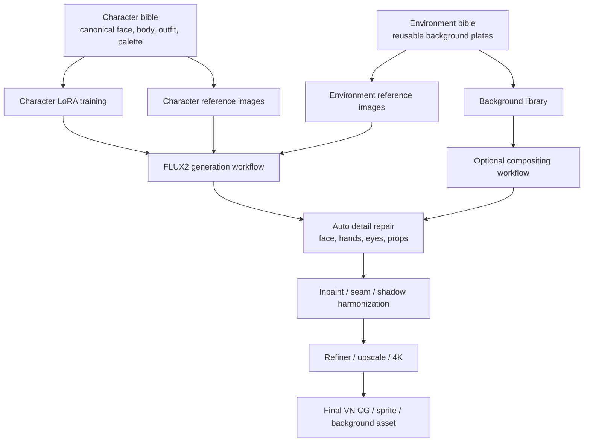

## 7. Workflow A: FLUX2 Integrated Scene Generation

Use this when the character needs to interact naturally with the environment, or
when lighting and perspective must be solved globally.

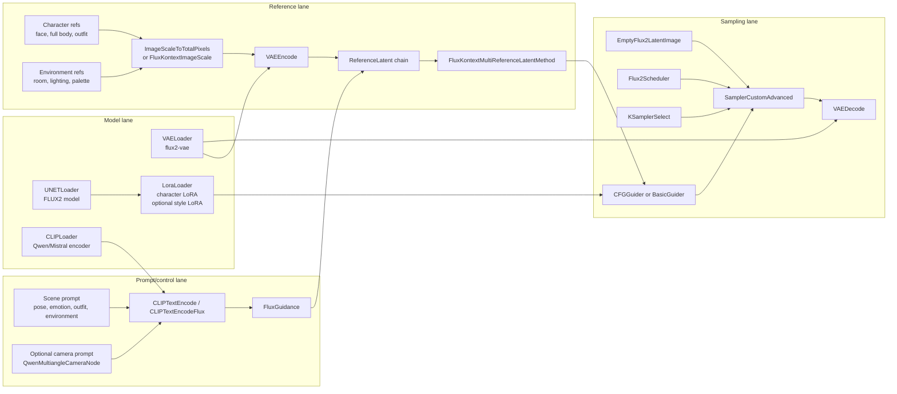

Use this for:

- Full CG scene generation.
- Character in environment with natural shadows.
- Complex interactions with furniture or props.
- Shots where background and character cannot be cleanly separated.

## 8. Workflow B: Decoupled Character And Background Plates

Use this as the default VN production workflow when reusable backgrounds and
consistent character sprites matter more than one-shot realism.

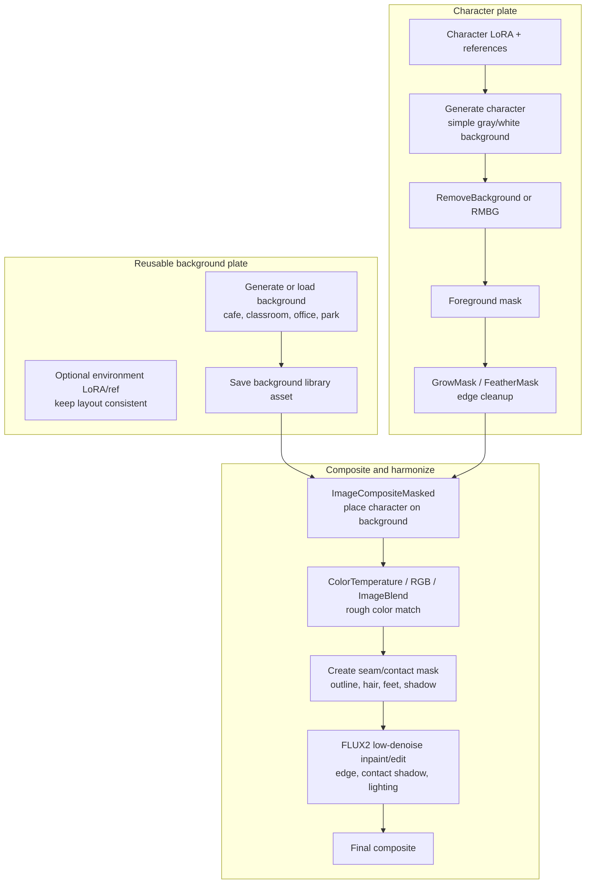

Why this works for VN:

- Backgrounds can be reused across many lines/scenes.
- Characters can be regenerated or posed independently.
- Identity consistency is easier because the character is not competing with a
  complex background during generation.
- The final FLUX2 harmonization pass can hide the layered look.

Limits:

- Physical interaction is harder: sitting, leaning, hand on table, reflection,
  complex occlusion.
- Strong colored lighting may require a heavier harmonization pass.
- Feet/contact shadows need special attention.

Useful additions:

```text
foreground occlusion layer
  e.g. cafe table, counter, desk, door frame
  -> composite above character
```

This creates depth without forcing the model to regenerate the whole scene.

### 8.1 Automatic Sprite Placement

The composition step can be manual or automatic. For VN production, make it
automatic by treating character placement as a deterministic layout problem.

The most reliable default is not "let the model decide where to put the
character." The reliable default is:

```text
background image
+ cutout character sprite
+ preset layout anchor
+ optional foreground occlusion mask
-> deterministic composite
-> low-denoise FLUX2 harmonization
```

For a bust sprite that should sit on the lower boundary, use anchor math.

Definitions:

```text
W, H       = background width and height
sw, sh     = scaled sprite width and height
anchor_x   = horizontal scene position
             0.25 left, 0.50 center, 0.75 right, 0.33 left-third
anchor_y   = vertical scene position
             usually 1.0 for bottom aligned
sprite_ax  = sprite anchor x inside its own image
             usually 0.5 for center of sprite
sprite_ay  = sprite anchor y inside its own image
             usually 1.0 for bottom of sprite
margin_y   = bottom margin, usually H * 0.02
```

Placement formula:

```text
x = round(W * anchor_x - sw * sprite_ax)
y = round(H * anchor_y - sh * sprite_ay - margin_y)

x = clamp(x, 0, W - sw)
y = clamp(y, 0, H - sh)
```

For a centered bust at the bottom:

```text
anchor_x  = 0.50
anchor_y  = 1.00
sprite_ax = 0.50
sprite_ay = 1.00
margin_y  = H * 0.02
```

For a bust placed around the left third:

```text
anchor_x = 0.33
```

For a bust that occupies the lower part of the frame, scale the sprite before
placement:

```text
target_sprite_height = H * 0.58 to H * 0.70
```

The exact value depends on the VN style. A talking bust often feels natural
around 60-70% of the canvas height. A smaller waist-up sprite may be closer to
50-58%.

ComfyUI implementation:

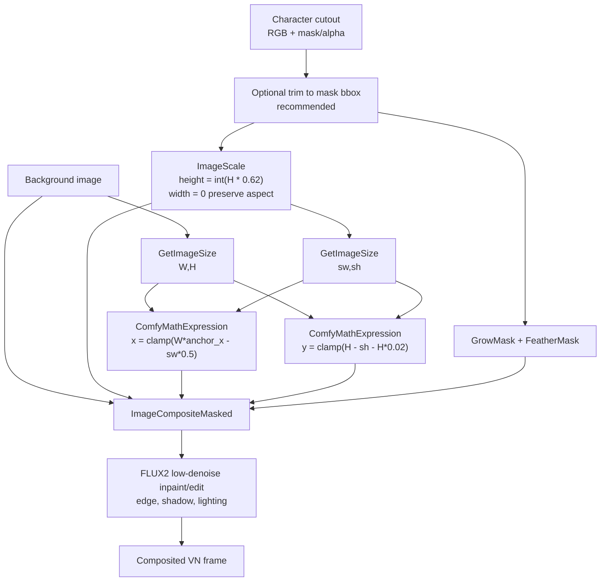

Using built-in nodes:

- `GetImageSize` gets background and sprite dimensions.
- `ImageScale` can scale the sprite by height while preserving aspect ratio by
  setting `width = 0`.
- `ComfyMathExpression` can compute `x`, `y`, and target height.
- `ImageCompositeMasked` places the sprite using explicit `x` and `y`.
- `GrowMask` and `FeatherMask` soften the matte before compositing.

Example `ComfyMathExpression` formulas:

```text
target_h:
int(a * 0.62)
where a = background height

x center:
max(0, min(a - b, round(a * 0.50 - b * 0.50)))
where a = background width, b = sprite width

x left-third:
max(0, min(a - b, round(a * 0.33 - b * 0.50)))
where a = background width, b = sprite width

y bottom:
max(0, min(a - b, round(a - b - a * 0.02)))
where a = background height, b = sprite height
```

For "sane position in the background", the best production approach is a
per-background safe-zone preset, not AI guessing every time.

Example:

```text
cafe_counter_wide:
  speaker_left:
    anchor_x: 0.30
    sprite_height_ratio: 0.64
    bottom_margin_ratio: 0.02
    foreground_occlusion: table_mask.png
  speaker_right:
    anchor_x: 0.70
    sprite_height_ratio: 0.64
    bottom_margin_ratio: 0.02
    foreground_occlusion: table_mask.png

classroom_front:
  speaker_center:
    anchor_x: 0.52
    sprite_height_ratio: 0.62
    bottom_margin_ratio: 0.02
```

This lets the VN script choose:

```text
background_id = cafe_counter_wide
slot = speaker_left
character = heroine_bust_happy
```

Then the workflow automatically composites the character into the same sane
position every time.

If the scene needs interaction with the background, add layers:

```text
background plate
-> character sprite
-> foreground occlusion mask/object, e.g. table/counter/door frame
-> FLUX2 low-denoise harmonization
```

This is more reliable than asking FLUX2 to regenerate the whole background
for every dialogue line.

### 8.2 Interaction Shots: Sitting, Leaning, Holding, Touching

Pure composition is best when the character is visually in front of the
background but does not physically interact with it.

If the character must sit on a chair, lean on a desk, hold a cup from the
scene, touch a wall, lie on a bed, or cast important contact shadows, use a
masked FLUX2 repaint workflow instead of simple paste-and-feather.

Reason:

```text
simple composition can place pixels
but it cannot solve body pose, chair occlusion, compression of clothing,
contact shadows, perspective, or believable weight
```

Recommended workflow:

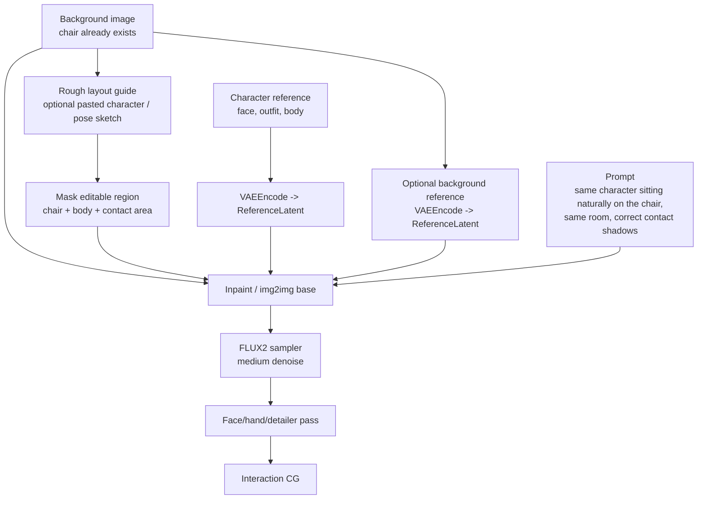

Good inputs:

- Original background image, preserved outside the mask.
- Character reference images through `ReferenceLatent`.
- Optional rough pasted character to communicate location and scale.
- Optional pose/depth guide if available.
- Mask that includes the chair, pelvis/legs/torso, arms/hands, and contact
  shadow area. Do not mask only the character; the chair must be allowed to
  adapt around the body.

Denoise guidance:

| Situation | Suggested denoise |
|---|---:|
| Composite already looks good; only edge/shadow fix | 0.20-0.35 |
| Character pose is close but chair contact is wrong | 0.35-0.55 |
| Character must be redrawn into a seated pose | 0.55-0.75 |
| Need a completely new integrated seated CG | 0.70+ or full generation |

For a chair scene, low denoise is often too conservative. It preserves the
rough pasted body, including the mistakes. Use enough denoise for FLUX2 to
redraw the seated body and modify the chair/contact region.

There are two practical lanes:

```text
Lane A: preserve background
background image + mask around chair/character
+ character references
-> FLUX2 inpaint
```

Use this when the exact background plate must remain mostly unchanged.

```text
Lane B: regenerate integrated scene
background reference + character reference + prompt
+ optional rough layout guide
-> FLUX2 img2img/generation
```

Use this for hero CGs where realism matters more than preserving every pixel of
the background.

Rule of thumb:

```text
dialogue bust in front of background -> deterministic composition
character partially behind table/counter -> composition + foreground occlusion + harmonization
character sitting/touching/holding/lying -> masked FLUX2 repaint or full integrated generation
```

## 9. Workflow C: Character Reference And LoRA Dataset Creation

Use a strong model for concept exploration and canonical design, then use the
open workflow for production data expansion when possible.

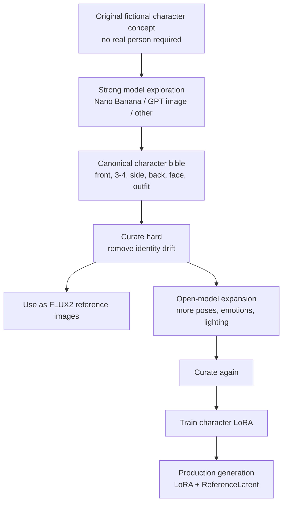

Dataset guidance:

- Prefer 20-40 excellent images over hundreds of inconsistent images.
- Reject beautiful images that look like a sibling or cosplay variant.
- Keep facial structure, eye design, hairline, body proportions, and signature
  costume elements stable.
- If outfit flexibility matters, consider separate identity and outfit concepts:

```text
character identity LoRA
+ outfit reference image or outfit LoRA
+ prompt-driven expression/pose
```

Terms warning:

- Some closed-source providers assign output ownership while still restricting
  use of outputs to develop competing models.
- For commercial work, verify provider terms before training LoRAs on outputs.
- Lower-risk use: closed model for concept/reference design, open model for
  dataset expansion and LoRA training.

Useful references:

- OpenAI Terms of Use: https://openai.com/policies/row-terms-of-use/
- Gemini API Additional Terms: https://ai.google.dev/gemini-api/terms

## 10. Workflow D: Multi-Reference Character And Environment Consistency

This is the core FLUX2 consistency block.

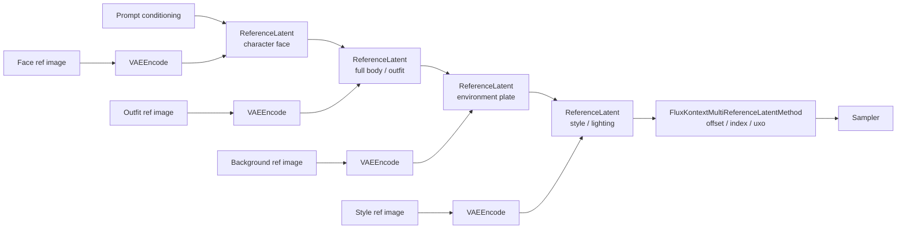

Best uses:

- Same character across scenes.
- Same outfit across many shots.
- Same room or background style across a scene.
- Combining character, environment, and lighting references.

Practical notes:

- Reference order matters. Keep a stable convention.
- Use fewer, stronger references before adding many weak references.
- Separate identity reference from outfit/reference when possible.
- Test `reference_latents_method` variants per model and workflow.

## 11. Workflow E: Camera Angle And Position Control

The current `QwenMultiangleCameraNode` is a prompt/control helper. For FLUX2
multi-angle use, it should emit FLUX2-specific prompt text and the normal
workflow should load the LoRA.

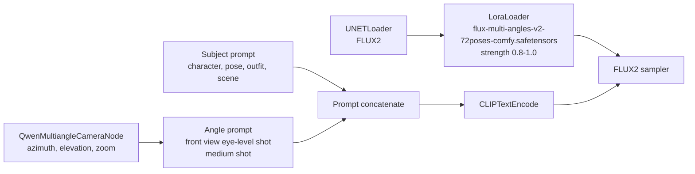

Use this for:

- Consistent front/side/back/quarter view prompts.
- VN character sheet generation.
- Sprite angles.

Do not expect it to replace pose ControlNet. It is camera/view language plus a
LoRA, not exact skeleton control.

## 12. Workflow F: Inpaint For Local Fixes

Use this for manually specified repairs: hands, eyes, clothing errors, seams,
props, or composite edges.

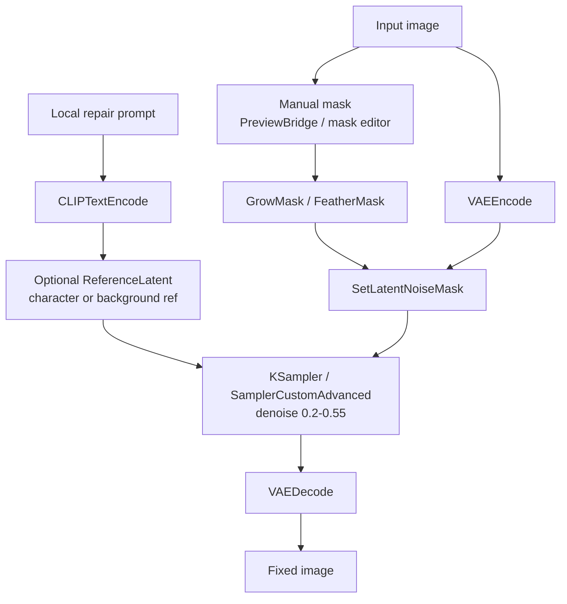

Suggested denoise:

| Use case | Denoise |
|---|---:|
| Seam / edge harmonization | 0.15-0.30 |
| Small detail fix | 0.25-0.45 |
| Hand repair with plausible base | 0.35-0.55 |
| Major redraw | 0.55+ |

Keep denoise low if identity, outfit, and background must remain unchanged.

## 13. Workflow G: Auto Detailer For Face, Hands, Eyes, Props

`FaceDetailer` and `DetailerForEach` are automated crop-inpaint-composite
systems.

`FaceDetailer` is the convenient wrapper for faces.

`DetailerForEach` is the more general primitive for any detected or masked
region.

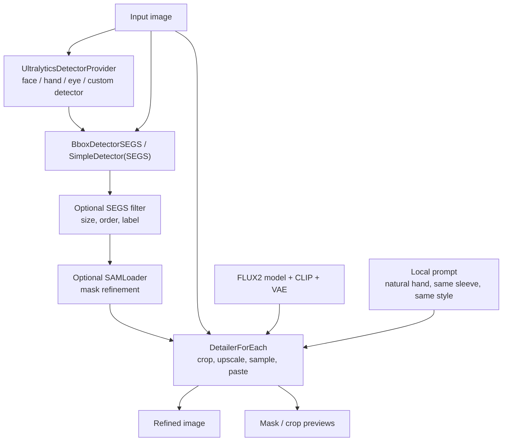

Use for:

- Automatic hand repair.
- Face repair after base generation.
- Eye repair.
- Local anatomy repair.
- Prop/object detail repair.

Important settings:

| Setting | Meaning |
|---|---|
| `guide_size` | Working resolution for the crop. Higher helps detail. |
| `bbox_crop_factor` | Context around detected region. Use more for hands. |
| `bbox_dilation` / mask dilation | Expands editable area. |
| `feather` | Hides paste seams. |
| `denoise` | How much the crop is regenerated. |

For hands, include wrist/sleeve/context. A tight hand-only crop often fails.

## 14. Workflow H: SD/Pony Base With FLUX2 Hand Fix

Use this only when SD/Pony has a style or control advantage. FLUX2 becomes the
repair model.

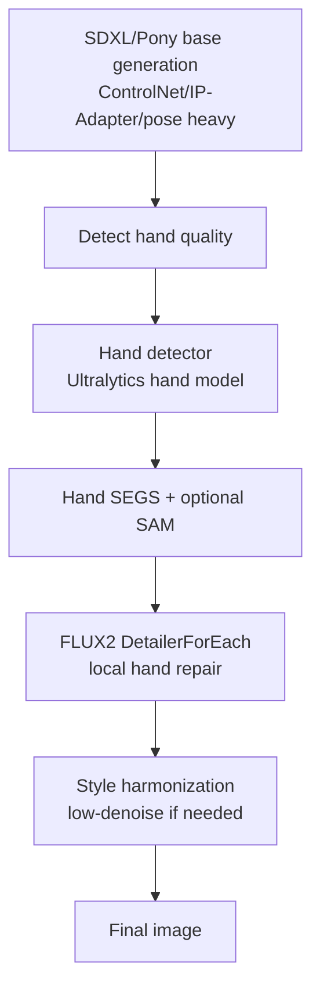

Expected performance:

- Good if the hand is detected and the base pose is plausible.
- Weak if the hand is too malformed for detection.
- Risky if FLUX2 redraws the hand in a style that does not match Pony/anime.

This is a rescue lane, not the preferred primary pipeline.

## 15. Workflow I: Refiner Pass

Use a refiner when the base composition is good but the surface quality needs
improvement.

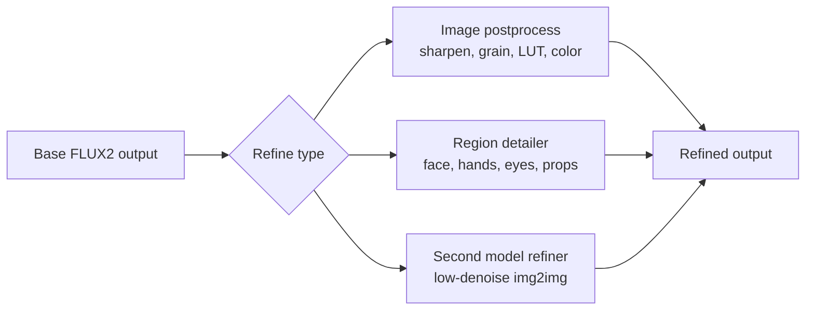

Recommended order:

```text
base generation
-> local detail repair
-> seam/inpaint repair
-> upscale
-> final light postprocess
```

Avoid heavy global refiners after the character identity is already correct,
unless the refiner is proven not to drift identity.

## 16. Workflow J: 4K Final Output

There are three useful 4K lanes.

### 16.1 Conservative Tiled Upscale

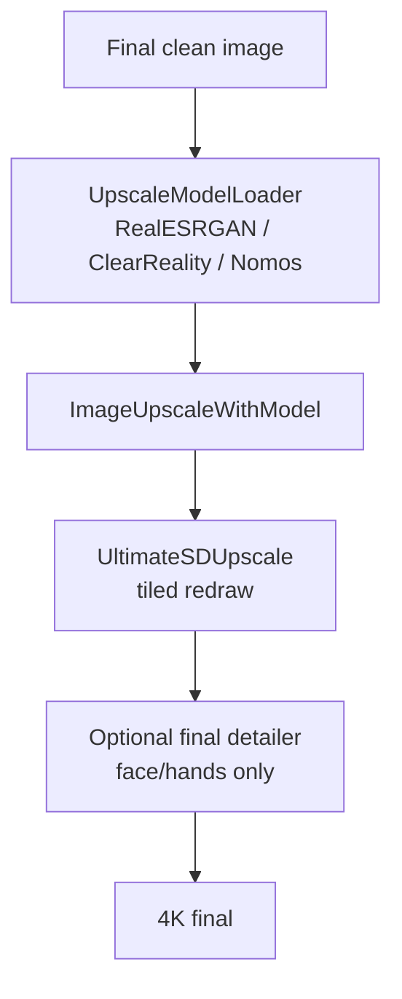

Best default for production because it is predictable and easy to inspect.

### 16.2 SeedVR2 Upscale

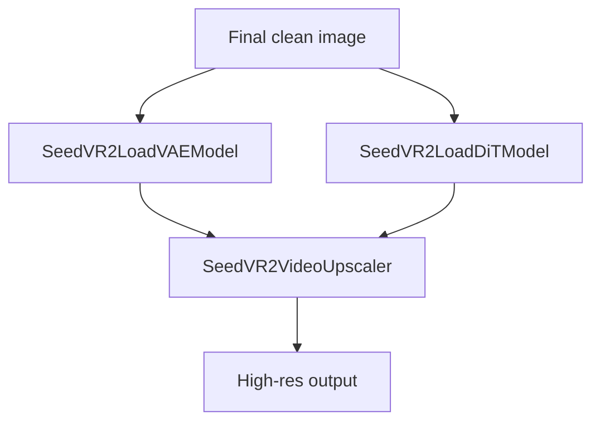

Useful for strong final enhancement, but heavier and less necessary for every
asset.

### 16.3 PiD 2K-to-4K Lane

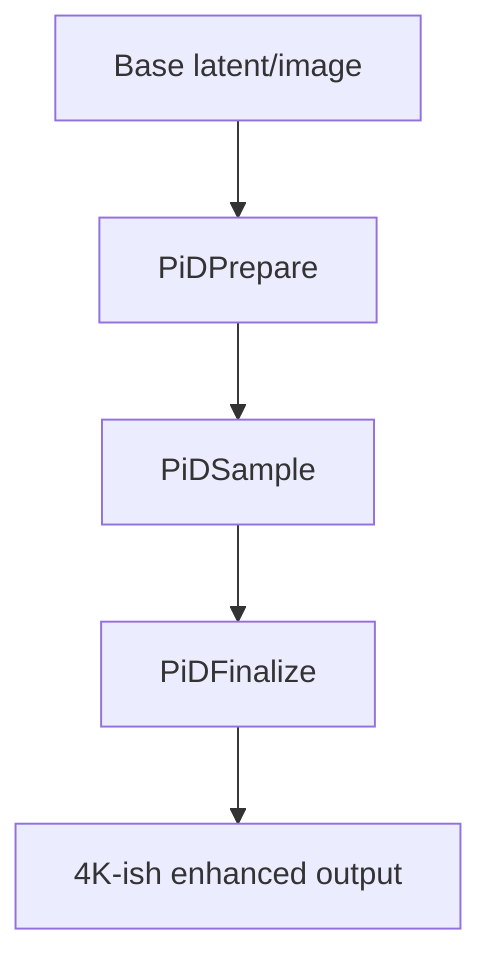

Useful when the PiD workflow is stable for the chosen model and resolution.

## 17. Environment Library Strategy

Build environments as reusable assets, not as incidental backgrounds.

For each location, create:

```text
location_id/
  master_prompt.md
  front.png
  left.png
  right.png
  close_table.png
  entrance.png
  night_variant.png
  day_variant.png
  foreground_occlusion_masks/
  depth_or_layout_guides/
```

For example:

```text
cafe_01/
  wide_counter_day.png
  table_closeup_day.png
  window_seat_evening.png
  table_foreground_mask.png
  chair_foreground_mask.png
```

Use FLUX2 references to preserve:

- Room layout.
- Furniture style.
- Color palette.
- Lighting.
- Key props.

Use compositing when:

- Character does not physically interact with the environment.
- You want the same background across many dialogue lines.
- You need fast iteration.

Use integrated generation when:

- The character touches furniture.
- The shot needs cast shadows/reflections.
- The character is partially occluded by the environment.
- Camera perspective is unusual.

## 18. Environment Camera Prompt Templates

For environment consistency tests, separate the prompt into two ideas:

```text
room identity = same place, same design language, same important objects
camera command = what changed in viewpoint, framing, focus, and visible area
```

Do not overuse "preserve the same background." That often causes a mirror/flip
failure. Use:

```text
same room identity, but a different camera view
```

When the new angle reveals areas not visible in the base image, explicitly tell
the model to infer them.

```text
Infer the unseen side of the same room logically, using the same design
language, materials, furniture quality, lighting, and layout logic.
```

### 18.1 Shared Room Identity Block

Use this block in every environment variation prompt.

```text
Use the attached image as the reference for the same {environment_type}.
Keep the same location identity: {style_description}, same lighting mood, same
material palette, same furniture design language, same floor/wall/ceiling
materials, same level of luxury/cleanliness, same color palette, same rendering
style, and the same overall atmosphere.

This should feel like the same place seen from a different camera position, not
a different location. Preserve the design logic and important identity anchors:
{identity_anchors}.

If the new camera angle reveals a part of the room that is not visible in the
reference image, infer that unseen area logically so it matches the same
environment. Do not mirror, flip, or simply repeat the original background.
```

Example hotel identity anchors:

```text
padded bed, minimalist headboard wall, warm bedside lamps, wood floor, beige
and dark wood palette, soft cove ceiling lights, large window/curtain design,
night city atmosphere, premium hotel furniture, polished 3D CG rendering style
```

Example cafe identity anchors:

```text
modern chain coffee shop interior, warm ceiling lights, wood and dark metal
materials, consistent tables and chairs, service counter design, window frames,
clean urban commercial layout, polished 2.5D / 3D CG VN background style
```

### 18.2 Reference Image To Environment Brief Pipeline

If the base environment starts from an image bank/reference image, do not rely
on the generation model to understand the image implicitly. First extract a
short structured environment brief, then feed both the original reference image
and the brief into the generation workflow.

Purpose:

```text
reference image
-> environment_type
-> scene_location / has_windows
-> style_description
-> identity_anchors / required_items
-> layout and character-safe-zone notes
-> extended VN background prompt
-> lighting/time variant prompts
```

This gives the AI both:

- visual reference: the actual image style, color, geometry, materials
- text brief: explicit constraints the model should preserve or expand

Recommended ComfyUI mini-pipeline:

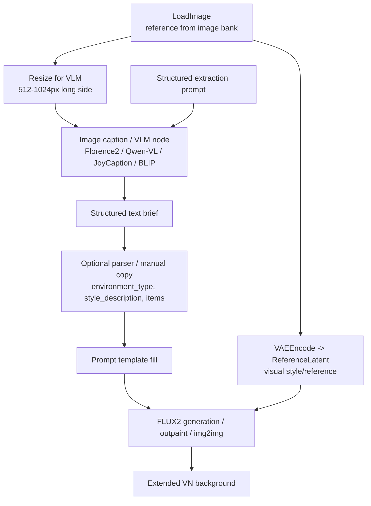

API/VLM node options:

| Route | Best use | Notes |
|---|---|---|
| Google Gemini Partner / GenMedia nodes | Structured image understanding with Gemini, especially if using Google/Vertex already | Gemini nodes support multimodal inputs and `application/json` style responses in the Google GenMedia custom node route. Good for `environment_type`, `items`, and JSON briefs. |
| `comfyui-gemini-nodes` | Easiest Gemini API-key workflow for structured JSON | Includes structured output, JSON extractor/parser, field extractor, and API-key setup. Good match for this exact brief extraction task. |
| OpenAI Chat / OpenAI-compatible vision node | GPT image understanding and prompt/brief generation | Use a vision-capable GPT model and ask for strict JSON. Good quality, but choose a node that supports image input and text output, not only image generation. |
| OpenAI-compatible LLM node | One node path for OpenAI, Grok/xAI, OpenRouter, local Ollama/LLaVA | Useful because xAI/Grok exposes OpenAI-compatible chat/image endpoints. Configure `base_url`, API key, and a vision-capable model. |
| Grok-specific community nodes | Grok vision/prompting experiments | Audit the node before putting API keys into it. Prefer OpenAI-compatible routing if the node ecosystem looks thin. |
| Local VLM nodes, e.g. Florence2/JoyCaption/BLIP/Qwen-VL | Offline captioning / no API cost | Good fallback, but API VLMs usually produce better structured briefs. |

Recommended first choice:

```text
Gemini structured-output node
or
OpenAI-compatible multimodal LLM node
```

The output should be JSON or YAML-like text, then either manually copied into
the prompt template or parsed by helper nodes.

Structured extraction prompt for the VLM/caption node:

```text
Analyze this image as a visual novel background reference. Return a concise
structured brief. Do not invent characters. Focus on environment, style, and
objects that should be preserved when generating an extended background.
Do not infer or describe the rendering medium; the project rendering style is
fixed separately as 3D Unity CG.

Return exactly these fields:

environment_type:
scene_location:
has_windows:
style_description:
lighting:
color_palette:
materials:
required_items:
layout_summary:
character_safe_zone:
identity_anchors:
avoid:

Definitions:
- environment_type: short category, e.g. luxury hotel room, modern coffee shop,
  classroom, office, convenience store.
- scene_location: indoor or outdoor.
- has_windows: for indoor scenes, whether exterior windows are visible. Use no
  for windowless scenes or scenes with only interior glass/mirrors/display
  cases. Use not_applicable for outdoor scenes.
- style_description: environment design language and mood, not rendering style.
- required_items: 3-8 important furniture/objects that should appear.
- layout_summary: where the main objects are placed.
- character_safe_zone: where a VN character could be composited without hiding
  important objects.
- identity_anchors: the 3-6 most important details that make this location
  recognizable.
- avoid: people, readable text, logos, clutter, objects that do not fit.
```

Example extracted brief:

```text
environment_type:
luxury hotel room

scene_location:
indoor

has_windows:
yes

style_description:
minimalist high-end modern hotel suite, warm calm atmosphere, premium but
uncluttered, beige and dark wood design

lighting:
warm bedside lamps, soft cove ceiling lights, night city glow from the window

color_palette:
beige, taupe, cream bedding, dark wood, warm amber light, deep blue night view

materials:
padded fabric headboard, dark wood panels, marble/stone bedside table, wood
floor, sheer curtains, heavy drapes

required_items:
king bed, pillows, blanket runner, padded headboard wall, bedside lamps,
bedside tables, large window, curtains, lounge chair, side table, city night
view

layout_summary:
bed on the left/center, window and lounge area on the right, open floor in the
lower right foreground

character_safe_zone:
lower right or lower center foreground, avoiding the bed and main window view

identity_anchors:
large padded bed, warm wall lighting, dark vertical wood panels, beige wall
panels, city night window, lounge chair near the window, clean luxury hotel
geometry

avoid:
people, characters, staff, readable logos, readable text, messy clutter,
different hotel style
```

Then fill the base-generation template:

```text
Use the attached reference image as the visual style and environment reference.
Generate an extended {environment_type} background for a visual novel.

Environment brief:
{structured_brief}

Target rendering style:
3D Unity CG rendering style, like a game environment rendered in Unity.

Create a wider, cleaner, reusable VN background plate that keeps the same
environment identity, design language, lighting, color palette, materials, and
important items. The output does not need to copy the exact crop or aspect ratio
of the input image. It should expand the environment logically and provide a
clear character-safe area at {character_safe_zone}.

No people, no characters, no staff, no readable text, no logos. Wide 16:9,
eye-level camera, natural perspective, 3D Unity CG rendering style.
```

For FLUX2, use the reference image in two ways:

```text
1. ReferenceLatent / image reference for visual consistency
2. structured brief in the text prompt for semantic consistency
```

If the reference image is small, low quality, or cropped, the text brief becomes
more important. If the reference image is strong and close to the target style,
the visual reference should carry more weight.

Suggested generation modes:

| Goal | Workflow mode | Notes |
|---|---|---|
| Same crop, cleaned up | img2img low/medium denoise | Preserves structure strongly |
| Wider VN plate from a cropped reference | outpaint or img2img with expanded canvas | Best for image-bank references |
| New full scene in same style | txt2img + `ReferenceLatent` | More freedom, more drift risk |
| Different camera view from reference | reference + camera command | Use anti-flip clause for large angle changes |

Small custom-node idea:

```text
VNEnvironmentBriefParser
input: structured brief text
outputs:
  environment_type
  style_description
  required_items
  identity_anchors
  character_safe_zone
  avoid
```

This node is optional, but useful if the workflow should be fully automatic
instead of manually copying fields from the VLM output into prompt templates.

Repo script:

```text
script/gemini_environment_briefs.py
```

This script scans a directory of reference images, calls Gemini directly, saves
one structured JSON brief per image, and renders the standard base-image prompt
next to it.

Default behavior:

```text
extract richer metadata
render compact generation prompt
render three lighting/time variant prompts
```

The compact prompt includes only the fields that should directly steer base
generation: `environment_type`, `scene_location`, `has_windows`,
`style_description`, `required_items`, and `avoid`. `character_safe_zone` and
`identity_anchors` are kept in JSON metadata for review/compositing, but the
prompt only expresses them softly as "preserve recognizable location identity"
and "leave usable character space." Optional fields such as lighting, palette,
materials, and layout summary are also kept in JSON unless `--prompt-detail
full` is used.
The rendering style is fixed by the script as 3D Unity CG rather than inferred
from the image.

Variant prompt rules:

| Scene classification | Generated prompt variants |
|---|---|
| outdoor | morning, afternoon, evening with practical lights on |
| indoor with exterior windows | daytime curtains/blinds open, nighttime curtains/blinds open with interior lights on, curtains/blinds closed with only indoor light |
| indoor without exterior windows | bright indoor light, warm indoor light, dim indoor light |

Example:

```bash
export GEMINI_API_KEY="your-key"

python3 script/gemini_environment_briefs.py /path/to/reference_images \
  --output-dir output/environment_briefs \
  --recursive \
  --model gemini-2.5-flash
```

Generation script:

```text
script/openai_generate_environment_images.py
```

This script reads the environment brief folder, uses `manifest.jsonl` to map
each source reference image to all prompt files for that image, calls OpenAI
`gpt-image-2`, and writes generated candidates plus per-image metadata.

Example:

```bash
export OPENAI_API_KEY="your-key"

python3 script/openai_generate_environment_images.py \
  output/environment_briefs \
  output/openai_environment_images \
  --images-per-prompt 2 \
  --max-images 12
```

### 18.3 Initial Base Scene Template

Use this to create the first environment plate.

```text
Generate a {environment_type} background for a visual novel.

Style and identity:
{style_description}. The image should establish a reusable location with clear
design identity: {identity_anchors}.

Composition:
Wide 16:9 visual novel background, eye-level camera, natural perspective,
readable depth, clean layout, no people, no characters, no staff, no readable
logos or text. Leave a clear character-safe foreground area around
{character_safe_zone}, so a standing or bust-up character can be placed later.

Rendering:
{rendering_style}, clean details, coherent geometry, reusable VN background
asset.
```

Hotel example:

```text
Generate a luxury hotel room background for a visual novel.

Style and identity:
Minimalist high-end modern hotel room, warm calm lighting, polished 3D CG
rendering style, beige and dark wood palette, premium materials, clean
uncluttered composition. The image should establish a reusable location with
clear design identity: king bed, padded headboard wall, bedside tables, warm
lamps, wall panels, wood floor, large window with curtains, city night view,
lounge chair, small side table.

Composition:
Wide 16:9 visual novel background, eye-level camera, natural perspective,
readable depth, clean layout, no people, no characters, no staff, no readable
logos or text. Leave a clear character-safe foreground area near the lower
center or lower right of the image.

Rendering:
Polished 3D CG illustration style, clean details, coherent geometry, reusable
VN background asset.
```

### 18.4 Generic Camera Variation Template

Use this for every follow-up image generated from a base/reference image.

```text
Use the attached image as the reference for the same {environment_type}.
{shared_room_identity_block}

Now change only the camera view:
{camera_command}

The new frame should preserve the same room identity and layout logic, but the
visible background should change naturally according to the new camera position.
Objects should move in the frame because of perspective, not because the room
became a different place.

Do not mirror, flip, or simply repaint the same visible background from the
reference image. If this angle reveals a wall, doorway, wardrobe, counter,
side area, or corner not visible in the reference, infer it in the same style.

No people, no characters, no staff, no readable logos or text. Wide 16:9 visual
novel background composition, eye-level camera, natural perspective,
{rendering_style}, reusable VN background asset.
```

### 18.5 `{camera_command}` Examples

Use `{camera_command}` to describe the camera as if a person is physically
walking through the location. Prefer concrete movement language over abstract
film terms when possible.

| Camera command | What it means | Expected background behavior |
|---|---|---|
| `Move the camera one or two steps forward toward the bed.` | Dolly forward / walk closer. The object becomes larger because the camera position changes. | Mostly same visible area, but nearby objects shift in perspective. |
| `Move the camera closer to the first table and rotate about 30 degrees to the left.` | Walk toward the table, then look left. Good for close table/cafe shots. | Same room identity; side/background area shifts leftward. |
| `Place the camera at the foot of the bed, looking toward the headboard.` | A concrete position and target. Viewer stands at `床尾` and looks toward `床头`. | Bed dominates foreground; headboard wall becomes the main background. |
| `Move the camera to the window side of the room, looking back toward the bed.` | New viewpoint from a named side of the room. | Window may leave the background; opposite wall/bed area becomes visible. |
| `Create a reverse-angle view from the opposite side of the room, looking back toward the original camera position.` | About 180 degree reverse shot. | Background should change strongly; infer unseen opposite wall/door/wardrobe/etc. |
| `Orbit around the bed by about 120 degrees toward the right side of the room.` | Camera moves around an anchor object, not just rotates in place. | Background behind the bed should change; avoid copied/flipped original window wall. |
| `Rotate the camera 30 degrees to the left from the same position.` | Pan/yaw left without walking. Use when only direction changes, not position. | Some new side content appears, but less than a dolly/orbit move. |
| `Truck the camera to the right while still looking at the bed.` | Side-step right, keeping the same focus target. | Parallax changes; foreground/background shift sideways. |
| `Pull the camera back toward the entrance, making the room feel wider.` | Dolly backward / step back. | More floor/room context appears; main object becomes smaller. |
| `Focus the camera on the bedside table while keeping the bed and room context visible.` | Closer framing around a specific object. | Background can crop/change, but enough context should remain for consistency. |
| `Raise the camera slightly above eye level, looking down gently at the room.` | Slight high-angle view. | Same layout with more floor/table surfaces visible. |
| `Lower the camera to seated eye level, looking across the bed.` | Lower viewpoint, useful for intimate VN room shots. | Furniture feels taller; bed/chair silhouettes become stronger. |

Terminology notes:

```text
move / walk / dolly = camera position changes; perspective changes
rotate / pan / yaw = camera direction changes from roughly the same position
orbit around object = camera position changes around an anchor object
zoom in = can mean optical crop; for generation, say "move closer" if
          perspective should change
reverse angle = camera looks from the other side, so unseen background must be
                inferred instead of copied
```

Good `{camera_command}` wording:

```text
Move the camera to {new_position}, looking toward {look_target}. The camera has
changed position, so objects should shift naturally in perspective. If this new
view reveals areas not visible in the reference, infer them in the same design
language instead of mirroring the original background.
```

Bad / risky wording:

```text
Keep the same background but rotate the camera.
```

That tends to produce a flipped or copied image. Use "same room identity" rather
than "same background" for large camera moves.

### 18.6 Zoom Toward Object Template

Use this when walking closer to a known object.

```text
Use the attached image as the reference for the same {environment_type}.
{shared_room_identity_block}

Move the camera closer toward {focus_object}, as if the viewer walks forward
inside the same room. The camera is now nearer to {focus_object}, so it should
become larger and more prominent in the foreground. Keep enough surrounding
environment visible to prove this is the same location.

Camera adjustment:
Zoom in / move forward toward {focus_object}. Rotate the camera {rotation}
from the original viewpoint. Keep eye-level perspective and natural geometry.

The surrounding {nearby_objects} should remain consistent with the reference
image, but their positions in the frame should change naturally because the
camera moved. Do not create a different room.

No people, no characters, no staff, no readable logos or text. Wide 16:9 VN
background, {rendering_style}.
```

Example:

```text
Move the camera closer toward the bed, as if the viewer walks forward into the
same hotel room. The bed should become larger and more prominent, while the
headboard, bedside lamps, wall panels, floor, curtains, and nearby furniture
remain consistent with the reference.
```

### 18.7 View From A Given Direction Template

Use this when the camera should stand at a concrete position and look toward a
concrete target.

```text
Use the attached image as the reference for the same {environment_type}.
{shared_room_identity_block}

Place the camera at {camera_position}, looking toward {look_target}. This is a
new viewpoint from inside the same room, as if a person is standing at
{camera_position} and looking toward {look_target}.

The main object should be {main_object}. Show it from this direction with
natural perspective. Keep the same design identity and same object designs, but
allow the visible background to change according to the new viewpoint.

If this viewpoint shows areas not visible in the reference, infer those areas
logically in the same style. Do not mirror or repeat the original background.

No people, no characters, no staff, no readable logos or text. Wide 16:9 VN
background, eye-level camera, {rendering_style}.
```

Example:

```text
Place the camera at the foot of the bed, looking toward the headboard, as if a
person is standing at the end of the bed and looking at the bed and headboard.
The bed should be large and central, extending from the foreground toward the
headboard.
```

### 18.8 Opposite Direction / Reverse Angle Template

Use this when the camera turns around and sees the opposite side of the same
room.

```text
Use the attached image as the reference for the same {environment_type}.
{shared_room_identity_block}

Create a reverse-angle view of the same room. Move the camera to
{new_camera_position} and look back toward {look_back_target}, as if the viewer
walked across the room and turned around.

Important: because this is a reverse-angle view, the visible background should
not be the same wall/window/corner from the reference image. Show the opposite
or side area of the same room. Infer unseen details logically, such as
{inferred_area_examples}, while keeping the same design language and material
palette.

The scene must feel like the same location, but not the same composition and
not a flipped copy. Preserve object identity where visible, but change the
visible background according to the new camera direction.

No people, no characters, no staff, no readable logos or text. Wide 16:9 VN
background, eye-level camera, {rendering_style}.
```

Hotel inferred-area examples:

```text
entrance wall, wardrobe, TV console, luggage bench, minibar cabinet, side wall
panels, hallway door, mirror, desk area, continuation of the same wood floor
and warm wall lighting
```

Cafe inferred-area examples:

```text
opposite seating wall, order counter side, entrance door, menu wall without
readable text, additional tables, service pickup area, window-side seating,
matching wood/metal finishes
```

### 18.9 Orbit Around An Anchor Object Template

Use this when rotating around a bed, table, counter, sofa, or other anchor.

```text
Use the attached image as the reference for the same {environment_type}.
{shared_room_identity_block}

Use {anchor_object} as the anchor of the camera move. Move the camera around
{anchor_object} by about {degrees} degrees toward the {direction}. The
{anchor_object} should remain recognizable as the same object, but it should be
seen from a new side angle.

Because the camera has orbited around the object, the background behind it
should change naturally. Do not keep the same window/wall/background unless it
would realistically still be visible from this new position. Infer the newly
visible side of the room in the same style.

No mirror flip, no copied original composition, no different room. Wide 16:9 VN
background, eye-level camera, {rendering_style}.
```

Example:

```text
Use the bed as the anchor of the camera move. Move the camera around the bed by
about 120 degrees toward the right side of the room. The bed should remain
recognizable as the same bed, but now it is seen from the other side. The
background behind the bed should change to the opposite/side area of the room,
such as the entrance wall, wardrobe, TV console, or side wall panels, matching
the same minimalist luxury hotel design.
```

### 18.10 Focus Item Template

Use this when the camera is inspecting one object while still keeping the
environment consistent.

```text
Use the attached image as the reference for the same {environment_type}.
{shared_room_identity_block}

Move the camera closer to {focus_item}. Make {focus_item} the main subject of
the frame, but keep enough surrounding room context visible to confirm this is
the same environment.

Preserve the same style, material quality, lighting, and nearby object design.
The visible background may change according to the closer camera position, but
it should remain logically part of the same room.

No people, no characters, no readable text or logos. Wide 16:9 VN background,
natural perspective, {rendering_style}.
```

### 18.11 Anti-Flip / Anti-Copy Clause

Add this clause when the model keeps producing flipped or copied views.

```text
Do not mirror, flip, or simply repeat the original image. The camera has moved
through the same physical environment, so the background must change according
to the new position. Keep the same room identity and design language, but infer
newly visible walls, furniture, corners, doors, counters, or side areas that
were not visible in the reference image.
```

### 18.12 Suggested Camera Test Sequence

For one environment, generate a small camera sheet:

```text
01_base_wide
02_step_forward_zoom_to_main_object
03_left_30_degrees
04_right_30_degrees
05_reverse_angle_180_degrees
06_orbit_anchor_120_degrees
07_focus_detail_object
08_character_safe_composition_plate
```

Workflow:

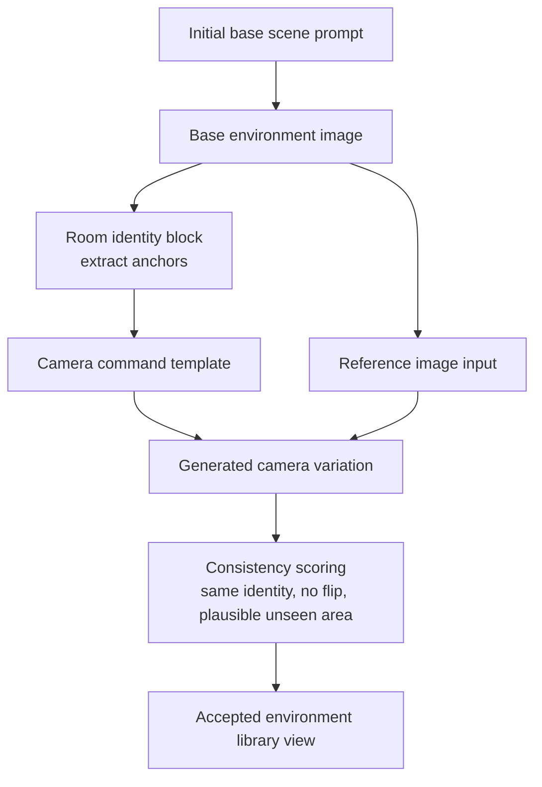

Evaluation questions:

- Does this still feel like the same room?
- Did the camera actually move?
- Does the visible background change when the camera direction requires it?
- Did the model infer unseen areas instead of flipping the source?
- Are there stable character-safe zones?
- Are foreground occlusion masks possible for this view?

## 19. Recommended First Workflows To Build

Build in this order.

### 19.1 Minimal FLUX2 Reference Workflow

```text
UNETLoader + CLIPLoader + VAELoader
+ CLIPTextEncode
+ ReferenceLatent chain for character/environment
+ EmptyFlux2LatentImage
+ Flux2Scheduler + sampler
+ VAEDecode + SaveImage
```

Purpose:

- Prove character/environment references.
- Test character LoRA interaction.
- Establish prompt conventions.

### 19.2 Character Sprite Composite Workflow

```text
character generation
-> RemoveBackground/RMBG
-> GrowMask/FeatherMask
-> ImageCompositeMasked over reusable background
-> FLUX2 seam/contact-shadow inpaint
```

Purpose:

- Fast VN dialogue assets.
- Reusable backgrounds.
- Stable character identity.

### 19.3 Auto Detailer Workflow

```text
image
-> face/hand detector
-> SEGS
-> DetailerForEach with FLUX2
-> compare/save
```

Purpose:

- Automated hand repair.
- Face/eye correction.
- Post-upscale artifact cleanup.

### 19.4 4K Finalization Workflow

```text
clean 1K/2K image
-> model upscale
-> UltimateSDUpscale or SeedVR2/PiD
-> final detailer
-> metadata save
```

Purpose:

- Produce final CG/background assets.

## 20. Evaluation Plan

Evaluate FLUX2 vs SD/Pony on the actual VN tasks, not generic image quality.

### 20.1 Character Consistency Test

Generate the same character in:

- 5 camera angles.
- 6 emotions.
- 3 outfits.
- 5 environments.
- 2 lighting conditions.

Score:

| Metric | What to inspect |
|---|---|
| Face identity | Eyes, nose, jaw, face shape |
| Hair identity | Shape, color, bangs, silhouette |
| Body proportion | Height, build, shoulder/waist ratio |
| Outfit fidelity | Signature costume details |
| Prompt following | Emotion, pose, shot type |
| Hand quality | Fingers, wrist, grip, object interaction |

### 20.2 Environment Consistency Test

Generate each location from multiple angles and times:

- Same room layout?
- Same furniture and prop placement?
- Same palette and material style?
- Does it tolerate character insertion?
- Are foreground occlusion masks easy to create?

### 20.3 Repair Pipeline Test

For each model family:

```text
base image
-> hand detector success rate
-> FLUX2 detailer repair
-> style match score
-> manual intervention count
```

The most important metric is not best image. It is:

```text
number of final usable VN assets per hour
```

## 21. Open Questions

- Which FLUX2 variant gives the best balance of style, consistency, and speed
  for the target VN art direction?
- Does character LoRA training on FLUX2 need separate identity and outfit LoRAs?
- How reliable is automatic hand detection on the target CG style?
- Which background removal model gives the cleanest edge for hair and transparent
  accessories?
- Is PiD or SeedVR2 worth the complexity compared with `UltimateSDUpscale`?
- Should foreground occlusion masks be hand-authored for important locations?

## 22. Practical Recommendation

Start with the decoupled VN pipeline:

```text
background library
+ character LoRA/reference sprite generation
+ automatic cutout
+ deterministic compositing
+ FLUX2 seam/shadow harmonization
+ auto detailer
+ 4K upscale
```

Use integrated FLUX2 scene generation for hero CGs, complex interactions, and
shots where shadows/perspective/occlusion are too important to fake.

Use SD/Pony only where it has a clear style or control advantage, then use
FLUX2 as the local repair/refiner model when needed.
