# Visual Novel FLUX2 Workflow Design

This document summarizes the workflow research and design decisions for a
visual novel production pipeline built around FLUX2, character consistency,
environment consistency, automated detail repair, and 4K final outputs.

The goal is not to run the reference workflows directly. The goal is to extract
the useful technical patterns and rebuild them into our own workflows.

## 1. Production Goal

The target project is a visual novel with reusable characters and reusable
environments. The likely visual style is 3D CG or 2.5D CG, where consistent
character design, clean hands, and repeatable backgrounds matter more than
single-image novelty.

Primary requirements:

- Consistent fictional characters across scenes, angles, emotions, and outfits.
- Consistent reusable environments, such as convenience store, park, cafe,
  office, classroom, hotel room, street, bedroom, and corridor.
- Good hands and local anatomy without manual repair whenever possible.
- Inpaint and detail repair for faces, hands, clothing, props, and seams.
- Optional decoupled character/background workflow for sprite-like production.
- Final 4K or near-4K images suitable for VN backgrounds and CGs.
- Practical LoRA/reference workflow for character identity.

## 2. Main Conclusion

Use FLUX2 as the primary generation and repair model unless a shot strongly
requires SDXL/Pony ecosystem tooling.

FLUX2 is attractive because:

- Better hand/detail behavior than most SD/Pony models.
- Native multi-reference conditioning through `ReferenceLatent`.
- Stronger prompt following and visual reasoning.
- Better fit for 3D CG / semi-real / 2.5D VN output.

SD/Pony is still useful when:

- A specific anime/Pony visual style is required.
- Mature ControlNet/IP-Adapter behavior is more important than anatomy.
- Existing character LoRAs already work well.
- Exact pose/layout control is required and FLUX2 tooling is insufficient.

Recommended default:

```text
FLUX2 base image
  + character LoRA
  + character reference images
  + environment reference images
  + optional camera-angle prompt helper
  -> local detail/inpaint pass
  -> refiner/upscale pass
  -> final output
```

Recommended fallback:

```text
SD/Pony base image
  -> FLUX2 hand/detail repair
  -> FLUX2 or image-space harmonization
  -> final output
```

## 3. Lessons From The Reference Workflows

The reference workflow folder contains several useful families:

| Workflow family | Useful idea | Reusable pattern |
|---|---|---|
| DA FLUX2/Klein union workflows | All-in-one txt2img/img2img/edit/reference/inpaint/outpaint flow | `ReferenceLatent`, mode switching, Florence prompt assist, ADetailer, inpaint/outpaint |
| Flux 2D and Klein workstation | Large production workstation | Reference conditioning, pseudo-control via preprocessing, RMBG, detailers, SeedVR2, SD upscale, postprocess |
| Moody Anime2Real | Stylized-to-real conversion and late detail repair | Generate base without heavy character LoRA, then face/detail LoRA in detailer |
| Moody F2K Edit | Controlled edit with references and manual/auto detailer | Second reference, manual mask repair, auto detection repair, SeedVR2 final upscale |
| Beard/Hairstyle selectors | Prompt-helper custom nodes | UI selector emits edit prompt plus preview image |
| FLUX2 PiD workflow | 2K-to-4K enhancement | PiD prepare/sample/finalize for higher-res lane |
| flux2KleinRefiner | Region-specific refiner | Detector/SAM/detailer passes for local regions |
| flux2Klein9BReference | Bulk reference transfer | Source reference image -> VAE -> `ReferenceLatent` -> target generation |

The reusable ideas are more important than the exact workflow files.

### 3.1 Reference Workflow Catalog

The files in `user/default/workflows/references/` are mostly useful as
pattern libraries. The exact model choices can be replaced later.

| Reference workflow | What it does | Important nodes/models observed | VN takeaway |
|---|---|---|---|
| `DA_flux2_klein-9b_distilled_union V2.6/V3.3/v4.5/v5.json` | General FLUX2/Klein workstation for txt2img, img2img, references, edit, inpaint, outpaint, and detail repair | `flux2Klein_9b.safetensors`, `flux2-vae.safetensors`, Qwen encoders, YOLO face/hand detectors, Florence2, Impact detailers, rgthree, LoraManager, ControlNet Aux, Resolution Master | Best source for the main integrated FLUX2 workflow shape |
| `Flux 2D & Klein_9b ver 5.0.3.json` | Huge production board with FLUX2, Klein variants, references, pseudo-control, RMBG, upscaling, SeedVR2, GGUF options, and postprocess | `ReferenceLatent`, `FluxKontextMultiReferenceLatentMethod`, depth preprocessors, RMBG/background removal, Impact Pack, Ultimate SD Upscale, SeedVR2, GGUF loader | Best source for a full studio pipeline; too large to copy directly |
| `Moody Anime2Real V3.2.json` | Converts stylized/anime-ish sources toward more realistic/semi-real output, then repairs faces/details | Face detector, SAM, face/detailer nodes, skin contrast LoRA, pixel upscale models, SeedVR2 | Useful if the VN style starts anime/Pony-like and needs FLUX2 polishing |
| `Moody F2K Edit Workflow - V3.json` | FLUX2/Klein edit workflow with references, manual masks, auto detailer, upscale, and final enhancement | Second reference lane, manual inpaint lane, auto detailer lane, SeedVR2, skin/detail LoRAs | Strong pattern for manual plus automatic repair in one board |
| `flux2Klein9BReference_v10.json` | Reference transfer workflow using source image conditioning | `VAEEncode`, `ReferenceLatent`, `LanPaint_KSampler`, head/face LoRA | Useful for character identity/reference transfer experiments |
| `flux2KleinRefiner_v21.json` | Region-specific refiner using detectors, SAM, and a second model/refiner lane | `UltralyticsDetectorProvider`, `SAMLoader`, `DetailerForEach`, detector models, FLUX2/Klein refiner models | Good pattern for localized repair after a base image is already acceptable |
| `FLUX.2+Dev｜PiD直出4K.json` | 2K-to-4K FLUX2 enhancement lane | `PiDPrepare`, `PiDSample`, `PiDFinalize`, `PiDKSamplerCapture`, `flux2_dev_fp8mixed`, `mistral_3_small_flux2_fp8`, `flux2-vae` | Dedicated 4K path to test after the base/refiner workflows are stable |
| `FLUX2_Img2Img_Workflow_v777-secret.json` | API-style FLUX2 img2img/reference workflow with LoRA stack and prompt banks | FLUX2/Klein model, Qwen encoder, FLUX2 VAE, LoRA stack, reference image flow | Reuse the img2img/reference structure, not the prompt content |
| `Beard Selector.json`, `Hairstyle Selector.json`, `ComfyUI-FluxLookSelector/` | Prompt helper nodes for visual look edits | `FluxBeardSelector`, `FluxHairstyleSelector`, preview images, FLUX2/Klein model, Qwen encoder | Nice UI idea for VN outfit/hair/expression selectors |
| `PornMaster_F2K_9B_turbo_Nipple_&_Areola Fix_2026_05_27.json` | Adult/anatomy-specific regional repair workflow | FLUX2/Klein model, Qwen encoder, Impact/LoraManager-style repair blocks | Only borrow the detector/detailer/refiner pattern if the project needs region-specific body repair |

### 3.2 Dependency Priority For The VN Pipeline

Install only what supports the pipeline we actually want. Do not start by
trying to satisfy every workflow dependency.

| Priority | Needed for | Custom nodes / packs |
|---|---|---|
| P0 | Core FLUX2 generation and references | Built-in FLUX2 nodes, `ReferenceLatent`, `FluxKontextMultiReferenceLatentMethod`, LoRA loader, image scale nodes |
| P0 | Character and hand repair | Impact Pack / Impact Subpack, Ultralytics detector support, SAM support |
| P0 | Compositing workflow | built-in background removal nodes or RMBG, mask nodes, `ImageCompositeMasked`, alpha split/join |
| P1 | Prompt/reference assistance | Florence2, rgthree, LoraManager, style selector/helper nodes |
| P1 | Position and camera experiments | `ComfyUI-qwenmultiangle`, ControlNet Aux preprocessors, depth preprocessors |
| P1 | 4K output | Ultimate SD Upscale, pixel upscale model loaders, SeedVR2 or PiD |
| P2 | Large-workstation convenience | KJ nodes, Easy-Use, LayerStyle, Crystools, image saver metadata nodes |
| P2 | Memory/speed variants | GGUF loader, FP8 model variants, alternative scheduler/sampler packs |

## 4. FLUX2 References vs IP-Adapter

FLUX2 reference images should be understood as native image-reference
conditioning, not as literal IP-Adapter.

In local ComfyUI:

- `ReferenceLatent` appends VAE latents into conditioning as
  `reference_latents`.
- FLUX-family model code consumes those latents as `ref_latents`.
- `FluxKontextMultiReferenceLatentMethod` controls how multiple reference
  latents are indexed or positioned.

Conceptually:

```text
SDXL IP-Adapter:
  image -> CLIP Vision features -> adapter cross-attention

FLUX2 ReferenceLatent:
  image -> VAE latent -> native FLUX reference tokens/conditioning
```

Practical meaning:

- For character/outfit/environment consistency, FLUX2 references can often play
  the same role as IP-Adapter in a production workflow.
- For exact pose, depth, line, edge, or segmentation control, SDXL ControlNet is
  still more mature and modular.
- FLUX2 reference strength is less like a simple "IP-Adapter weight" slider and
  more like model-native conditioning behavior.

## 5. Node Inventory

### 5.1 Core FLUX2 Nodes

| Purpose | Node |
|---|---|
| Load diffusion model | `UNETLoader` or `UnetLoaderGGUF` |
| Load text encoder | `CLIPLoader` |
| Load VAE | `VAELoader` |
| Encode prompt | `CLIPTextEncode` or `CLIPTextEncodeFlux` |
| Guidance | `FluxGuidance` or `CFGGuider` |
| Empty latent | `EmptyFlux2LatentImage` |
| Schedule | `Flux2Scheduler` |
| Sampler selection | `KSamplerSelect` |
| Sampling | `SamplerCustomAdvanced`, `KSampler`, `KSamplerAdvanced` |
| Decode | `VAEDecode` |
| Encode image to latent | `VAEEncode` |
| Image reference | `ReferenceLatent` |
| Multi-reference method | `FluxKontextMultiReferenceLatentMethod` |
| Reference image scaling | `FluxKontextImageScale`, `ImageScaleToTotalPixels` |

### 5.2 Character And Environment Consistency

| Purpose | Node |
|---|---|
| Reference image conditioning | `ReferenceLatent` |
| Reference image latent | `VAEEncode` |
| Reference resize | `ImageScaleToTotalPixels`, `FluxKontextImageScale` |
| Multi-image order/method | `FluxKontextMultiReferenceLatentMethod` |
| Character LoRA | `LoraLoader`, `Power Lora Loader (rgthree)`, `Lora Loader (LoraManager)` |
| Prompt assembly | `JoinStrings`, `PrimitiveStringMultiline`, `AnyConcatNode` |

### 5.3 Position, Pose, And Camera Control

| Purpose | Node |
|---|---|
| Camera angle prompt helper | `QwenMultiangleCameraNode` |
| FLUX2 multi-angle LoRA | normal `LoraLoader` with `flux-multi-angles-v2-72poses-comfy.safetensors` |
| Depth / pseudo-control image | `DepthAnythingV2Preprocessor`, `AIO_Preprocessor` |
| Pose/control-like reference | preprocessed image -> `VAEEncode` -> `ReferenceLatent` |
| Exact SD-style control fallback | SDXL/Pony ControlNet / OpenPose / Depth workflow |

### 5.4 Background Removal And Compositing

| Purpose | Node |
|---|---|
| Load background removal model | `LoadBackgroundRemovalModel` |
| Generate foreground mask | `RemoveBackground` |
| Alternative background remover | `RMBG` |
| Composite character over background | `ImageCompositeMasked` |
| Alpha split/join | `SplitImageWithAlpha`, `JoinImageWithAlpha` |
| Mask extraction | `ImageToMask`, `MaskToImage` |
| Mask cleanup | `GrowMask`, `FeatherMask`, `InvertMask`, `ThresholdMask` |
| Color/light match | `LayerColor: RGB`, `LayerColor: ColorTemperature`, `FL_ImageAdjuster`, `ImageBlend` |

### 5.5 Inpaint And Detail Repair

| Purpose | Node |
|---|---|
| Manual mask inpaint | `SetLatentNoiseMask`, `VAEEncode`, `KSampler` |
| Inpaint conditioning | `InpaintModelConditioning` |
| Mask to detail region | `MaskToSEGS` |
| Auto detector | `UltralyticsDetectorProvider` |
| Segmentation assist | `SAMLoader` |
| Face repair shortcut | `FaceDetailer` |
| General region repair | `DetailerForEach` |
| SEGS manipulation | `BboxDetectorSEGS`, `SegsToCombinedMask`, `ImpactDilateMask`, `ImpactSEGSOrderedFilter` |
| Mask preview/manual edit | `PreviewBridge`, `MaskPreview`, `MaskPreview+` |

### 5.6 Refiner And 4K Output

| Purpose | Node |
|---|---|
| Pixel upscale model | `UpscaleModelLoader`, `ImageUpscaleWithModel` |
| SD-style tiled upscale | `UltimateSDUpscale` |
| SeedVR2 final upscale | `SeedVR2LoadVAEModel`, `SeedVR2LoadDiTModel`, `SeedVR2VideoUpscaler` |
| PiD 2K-to-4K lane | `PiDPrepare`, `PiDSample`, `PiDFinalize`, `PiDKSamplerCapture` |
| Metadata save | `Image Saver Metadata`, `SaveImageWithMetaData` |
| Postprocess | `ImageCASharpening+`, `FastFilmGrain`, LUT/color nodes |

## 6. Overall VN Production Architecture

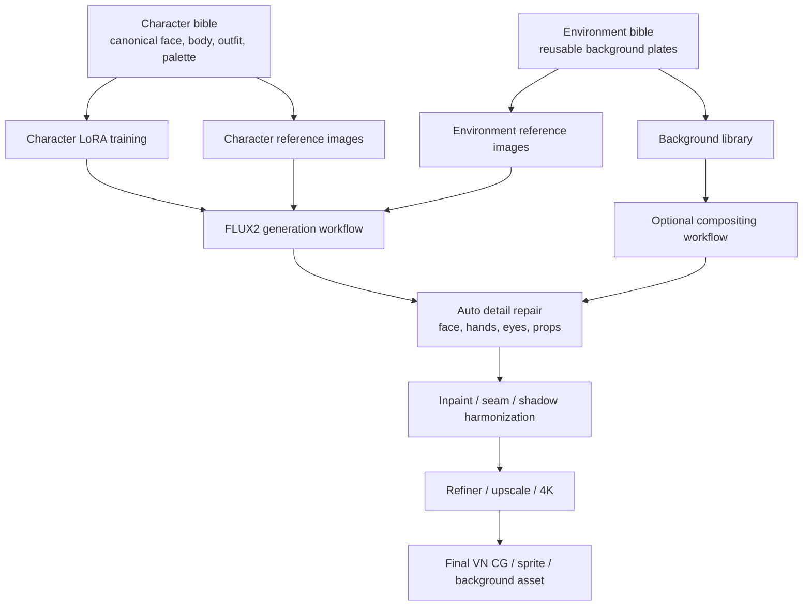

## 7. Workflow A: FLUX2 Integrated Scene Generation

Use this when the character needs to interact naturally with the environment, or
when lighting and perspective must be solved globally.

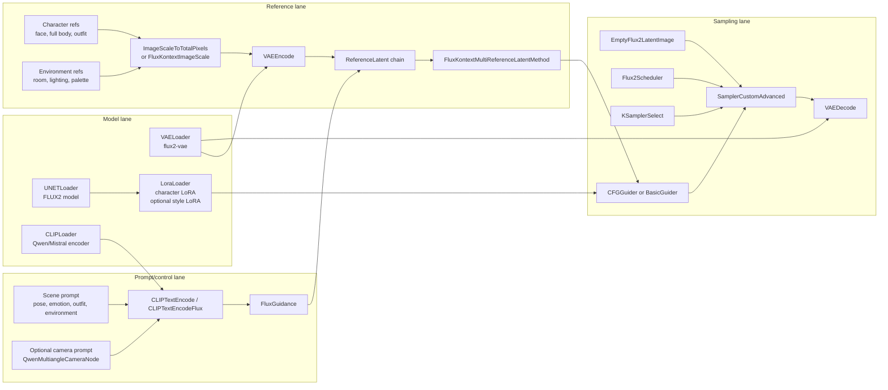

Use this for:

- Full CG scene generation.
- Character in environment with natural shadows.
- Complex interactions with furniture or props.
- Shots where background and character cannot be cleanly separated.

## 8. Workflow B: Decoupled Character And Background Plates

Use this as the default VN production workflow when reusable backgrounds and
consistent character sprites matter more than one-shot realism.

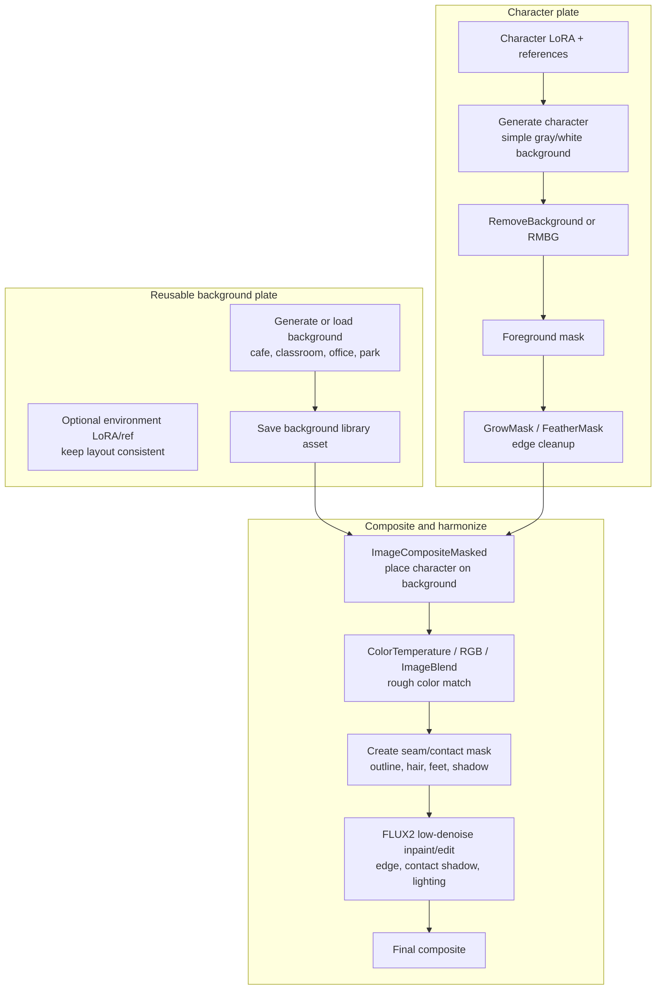

Why this works for VN:

- Backgrounds can be reused across many lines/scenes.
- Characters can be regenerated or posed independently.
- Identity consistency is easier because the character is not competing with a
  complex background during generation.
- The final FLUX2 harmonization pass can hide the layered look.

Limits:

- Physical interaction is harder: sitting, leaning, hand on table, reflection,
  complex occlusion.
- Strong colored lighting may require a heavier harmonization pass.
- Feet/contact shadows need special attention.

Useful additions:

```text
foreground occlusion layer
  e.g. cafe table, counter, desk, door frame
  -> composite above character
```

This creates depth without forcing the model to regenerate the whole scene.

### 8.1 Automatic Sprite Placement

The composition step can be manual or automatic. For VN production, make it
automatic by treating character placement as a deterministic layout problem.

The most reliable default is not "let the model decide where to put the
character." The reliable default is:

```text
background image
+ cutout character sprite
+ preset layout anchor
+ optional foreground occlusion mask
-> deterministic composite
-> low-denoise FLUX2 harmonization
```

For a bust sprite that should sit on the lower boundary, use anchor math.

Definitions:

```text
W, H       = background width and height
sw, sh     = scaled sprite width and height
anchor_x   = horizontal scene position
             0.25 left, 0.50 center, 0.75 right, 0.33 left-third
anchor_y   = vertical scene position
             usually 1.0 for bottom aligned
sprite_ax  = sprite anchor x inside its own image
             usually 0.5 for center of sprite
sprite_ay  = sprite anchor y inside its own image
             usually 1.0 for bottom of sprite
margin_y   = bottom margin, usually H * 0.02
```

Placement formula:

```text
x = round(W * anchor_x - sw * sprite_ax)
y = round(H * anchor_y - sh * sprite_ay - margin_y)

x = clamp(x, 0, W - sw)
y = clamp(y, 0, H - sh)
```

For a centered bust at the bottom:

```text
anchor_x  = 0.50
anchor_y  = 1.00
sprite_ax = 0.50
sprite_ay = 1.00
margin_y  = H * 0.02
```

For a bust placed around the left third:

```text
anchor_x = 0.33
```

For a bust that occupies the lower part of the frame, scale the sprite before
placement:

```text
target_sprite_height = H * 0.58 to H * 0.70
```

The exact value depends on the VN style. A talking bust often feels natural
around 60-70% of the canvas height. A smaller waist-up sprite may be closer to
50-58%.

ComfyUI implementation:

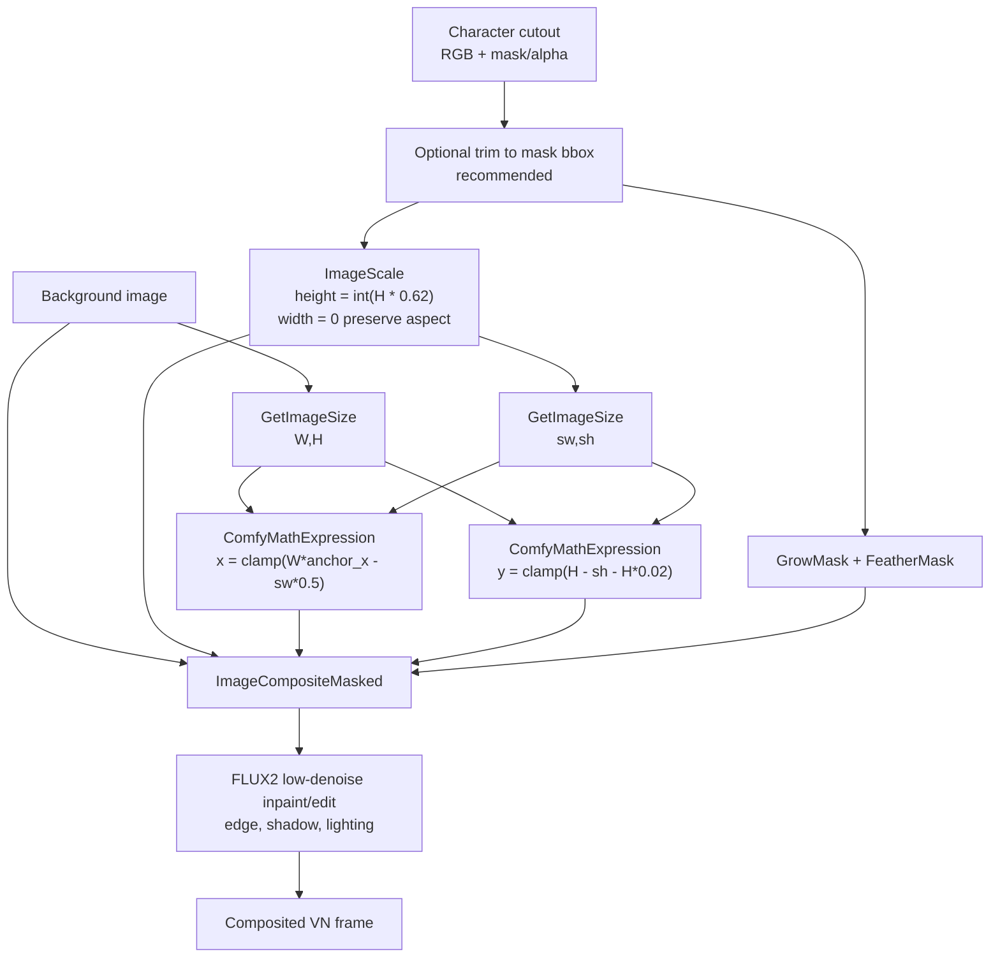

Using built-in nodes:

- `GetImageSize` gets background and sprite dimensions.
- `ImageScale` can scale the sprite by height while preserving aspect ratio by
  setting `width = 0`.
- `ComfyMathExpression` can compute `x`, `y`, and target height.
- `ImageCompositeMasked` places the sprite using explicit `x` and `y`.
- `GrowMask` and `FeatherMask` soften the matte before compositing.

Example `ComfyMathExpression` formulas:

```text
target_h:
int(a * 0.62)
where a = background height

x center:
max(0, min(a - b, round(a * 0.50 - b * 0.50)))
where a = background width, b = sprite width

x left-third:
max(0, min(a - b, round(a * 0.33 - b * 0.50)))
where a = background width, b = sprite width

y bottom:
max(0, min(a - b, round(a - b - a * 0.02)))
where a = background height, b = sprite height
```

For "sane position in the background", the best production approach is a
per-background safe-zone preset, not AI guessing every time.

Example:

```text
cafe_counter_wide:
  speaker_left:
    anchor_x: 0.30
    sprite_height_ratio: 0.64
    bottom_margin_ratio: 0.02
    foreground_occlusion: table_mask.png
  speaker_right:
    anchor_x: 0.70
    sprite_height_ratio: 0.64
    bottom_margin_ratio: 0.02
    foreground_occlusion: table_mask.png

classroom_front:
  speaker_center:
    anchor_x: 0.52
    sprite_height_ratio: 0.62
    bottom_margin_ratio: 0.02
```

This lets the VN script choose:

```text
background_id = cafe_counter_wide
slot = speaker_left
character = heroine_bust_happy
```

Then the workflow automatically composites the character into the same sane
position every time.

If the scene needs interaction with the background, add layers:

```text
background plate
-> character sprite
-> foreground occlusion mask/object, e.g. table/counter/door frame
-> FLUX2 low-denoise harmonization
```

This is more reliable than asking FLUX2 to regenerate the whole background
for every dialogue line.

### 8.2 Interaction Shots: Sitting, Leaning, Holding, Touching

Pure composition is best when the character is visually in front of the
background but does not physically interact with it.

If the character must sit on a chair, lean on a desk, hold a cup from the
scene, touch a wall, lie on a bed, or cast important contact shadows, use a
masked FLUX2 repaint workflow instead of simple paste-and-feather.

Reason:

```text
simple composition can place pixels
but it cannot solve body pose, chair occlusion, compression of clothing,
contact shadows, perspective, or believable weight
```

Recommended workflow:

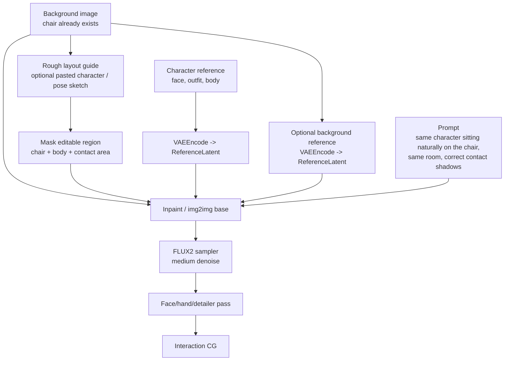

Good inputs:

- Original background image, preserved outside the mask.
- Character reference images through `ReferenceLatent`.
- Optional rough pasted character to communicate location and scale.
- Optional pose/depth guide if available.
- Mask that includes the chair, pelvis/legs/torso, arms/hands, and contact
  shadow area. Do not mask only the character; the chair must be allowed to
  adapt around the body.

Denoise guidance:

| Situation | Suggested denoise |
|---|---:|
| Composite already looks good; only edge/shadow fix | 0.20-0.35 |
| Character pose is close but chair contact is wrong | 0.35-0.55 |
| Character must be redrawn into a seated pose | 0.55-0.75 |
| Need a completely new integrated seated CG | 0.70+ or full generation |

For a chair scene, low denoise is often too conservative. It preserves the
rough pasted body, including the mistakes. Use enough denoise for FLUX2 to
redraw the seated body and modify the chair/contact region.

There are two practical lanes:

```text
Lane A: preserve background
background image + mask around chair/character
+ character references
-> FLUX2 inpaint
```

Use this when the exact background plate must remain mostly unchanged.

```text
Lane B: regenerate integrated scene
background reference + character reference + prompt
+ optional rough layout guide
-> FLUX2 img2img/generation
```

Use this for hero CGs where realism matters more than preserving every pixel of
the background.

Rule of thumb:

```text
dialogue bust in front of background -> deterministic composition
character partially behind table/counter -> composition + foreground occlusion + harmonization
character sitting/touching/holding/lying -> masked FLUX2 repaint or full integrated generation
```

## 9. Workflow C: Character Reference And LoRA Dataset Creation

Use a strong model for concept exploration and canonical design, then use the
open workflow for production data expansion when possible.

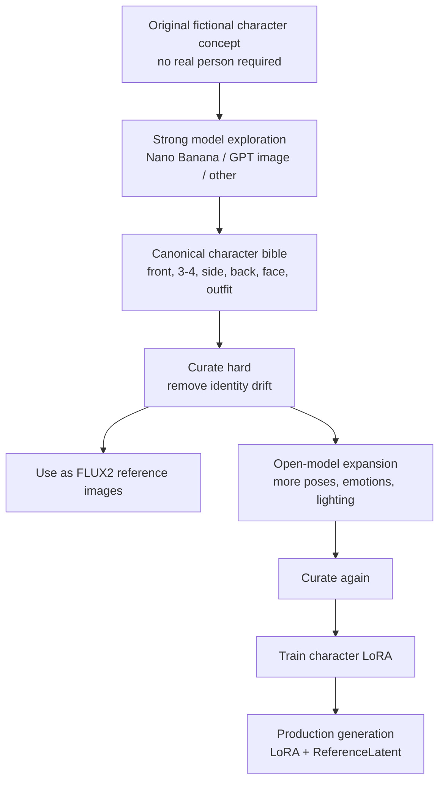

Dataset guidance:

- Prefer 20-40 excellent images over hundreds of inconsistent images.
- Reject beautiful images that look like a sibling or cosplay variant.
- Keep facial structure, eye design, hairline, body proportions, and signature
  costume elements stable.
- If outfit flexibility matters, consider separate identity and outfit concepts:

```text
character identity LoRA
+ outfit reference image or outfit LoRA
+ prompt-driven expression/pose
```

Terms warning:

- Some closed-source providers assign output ownership while still restricting
  use of outputs to develop competing models.
- For commercial work, verify provider terms before training LoRAs on outputs.
- Lower-risk use: closed model for concept/reference design, open model for
  dataset expansion and LoRA training.

Useful references:

- OpenAI Terms of Use: https://openai.com/policies/row-terms-of-use/
- Gemini API Additional Terms: https://ai.google.dev/gemini-api/terms

## 10. Workflow D: Multi-Reference Character And Environment Consistency

This is the core FLUX2 consistency block.

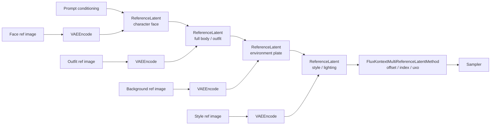

Best uses:

- Same character across scenes.
- Same outfit across many shots.
- Same room or background style across a scene.
- Combining character, environment, and lighting references.

Practical notes:

- Reference order matters. Keep a stable convention.
- Use fewer, stronger references before adding many weak references.
- Separate identity reference from outfit/reference when possible.
- Test `reference_latents_method` variants per model and workflow.

## 11. Workflow E: Camera Angle And Position Control

The current `QwenMultiangleCameraNode` is a prompt/control helper. For FLUX2
multi-angle use, it should emit FLUX2-specific prompt text and the normal
workflow should load the LoRA.

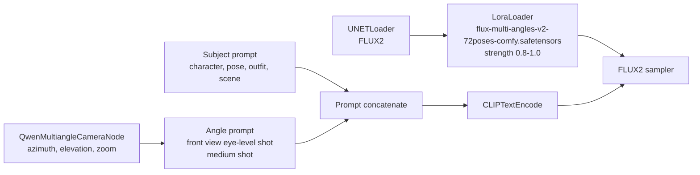

Use this for:

- Consistent front/side/back/quarter view prompts.
- VN character sheet generation.
- Sprite angles.

Do not expect it to replace pose ControlNet. It is camera/view language plus a
LoRA, not exact skeleton control.

## 12. Workflow F: Inpaint For Local Fixes

Use this for manually specified repairs: hands, eyes, clothing errors, seams,
props, or composite edges.

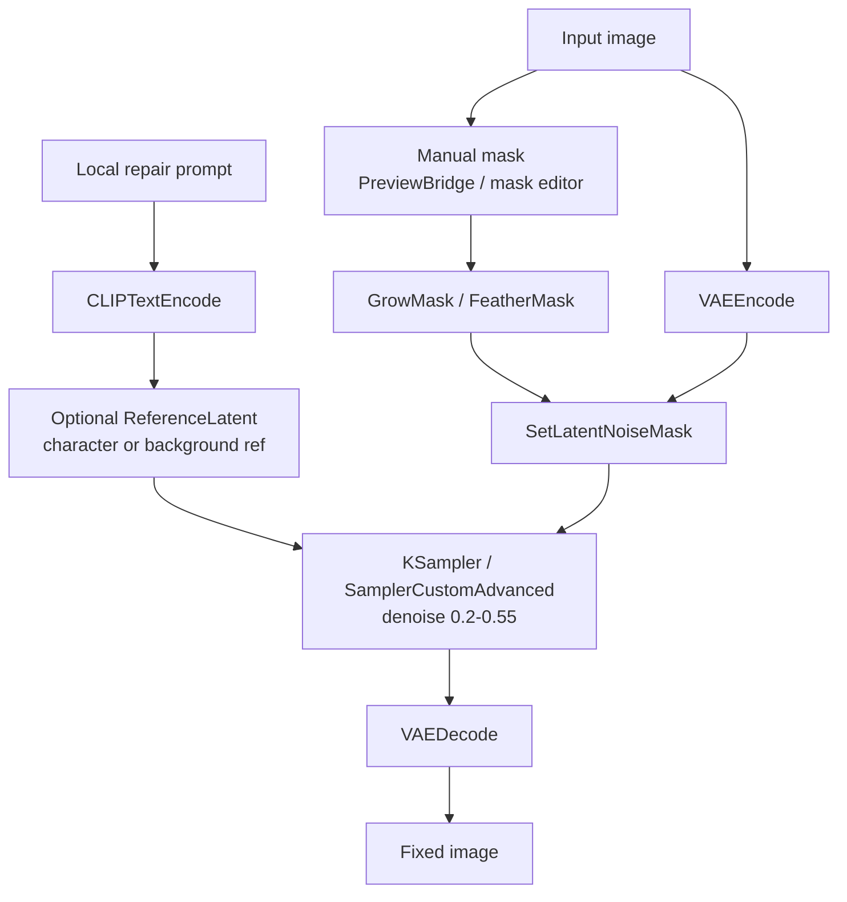

Suggested denoise:

| Use case | Denoise |
|---|---:|
| Seam / edge harmonization | 0.15-0.30 |
| Small detail fix | 0.25-0.45 |
| Hand repair with plausible base | 0.35-0.55 |
| Major redraw | 0.55+ |

Keep denoise low if identity, outfit, and background must remain unchanged.

## 13. Workflow G: Auto Detailer For Face, Hands, Eyes, Props

`FaceDetailer` and `DetailerForEach` are automated crop-inpaint-composite
systems.

`FaceDetailer` is the convenient wrapper for faces.

`DetailerForEach` is the more general primitive for any detected or masked
region.

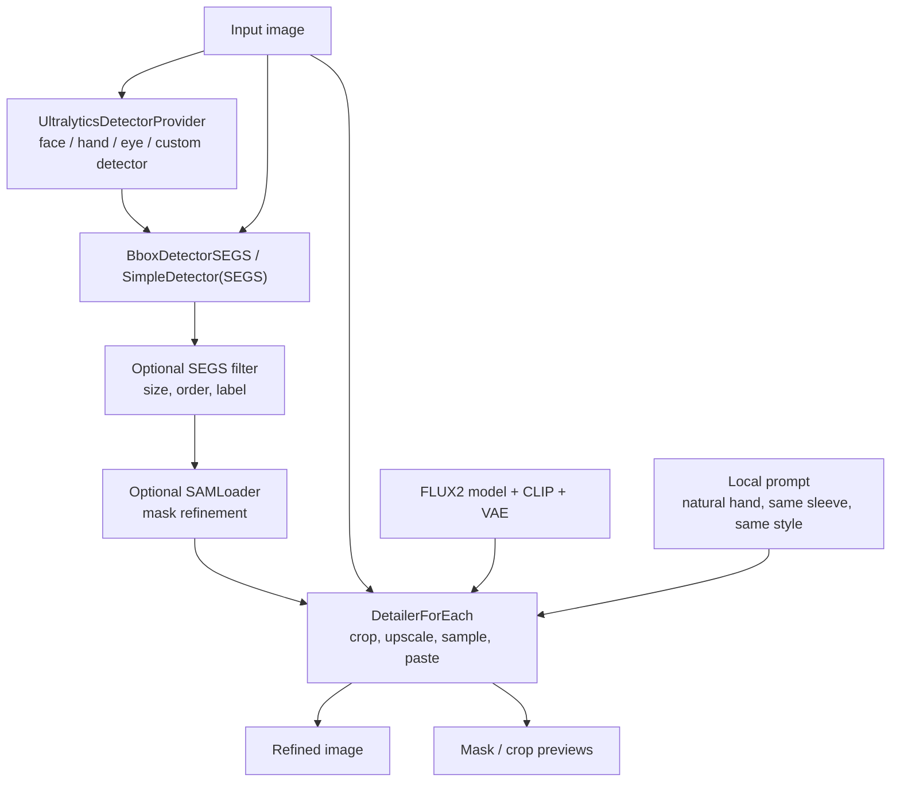

Use for:

- Automatic hand repair.
- Face repair after base generation.
- Eye repair.
- Local anatomy repair.
- Prop/object detail repair.

Important settings:

| Setting | Meaning |
|---|---|
| `guide_size` | Working resolution for the crop. Higher helps detail. |
| `bbox_crop_factor` | Context around detected region. Use more for hands. |
| `bbox_dilation` / mask dilation | Expands editable area. |
| `feather` | Hides paste seams. |
| `denoise` | How much the crop is regenerated. |

For hands, include wrist/sleeve/context. A tight hand-only crop often fails.

## 14. Workflow H: SD/Pony Base With FLUX2 Hand Fix

Use this only when SD/Pony has a style or control advantage. FLUX2 becomes the
repair model.

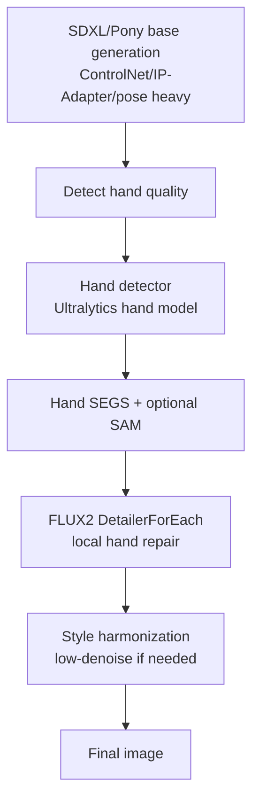

Expected performance:

- Good if the hand is detected and the base pose is plausible.
- Weak if the hand is too malformed for detection.
- Risky if FLUX2 redraws the hand in a style that does not match Pony/anime.

This is a rescue lane, not the preferred primary pipeline.

## 15. Workflow I: Refiner Pass

Use a refiner when the base composition is good but the surface quality needs
improvement.

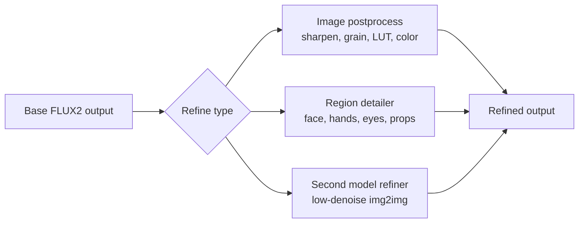

Recommended order:

```text
base generation
-> local detail repair
-> seam/inpaint repair
-> upscale
-> final light postprocess
```

Avoid heavy global refiners after the character identity is already correct,
unless the refiner is proven not to drift identity.

## 16. Workflow J: 4K Final Output

There are three useful 4K lanes.

### 16.1 Conservative Tiled Upscale

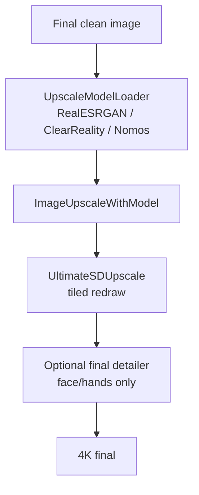

Best default for production because it is predictable and easy to inspect.

### 16.2 SeedVR2 Upscale

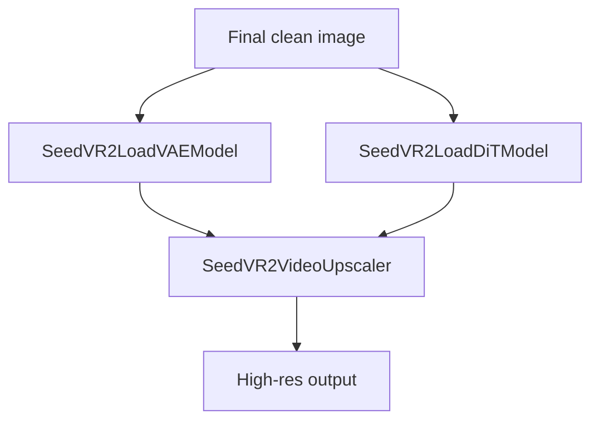

Useful for strong final enhancement, but heavier and less necessary for every
asset.

### 16.3 PiD 2K-to-4K Lane

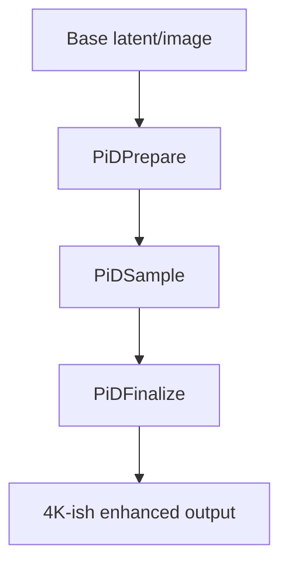

Useful when the PiD workflow is stable for the chosen model and resolution.

## 17. Environment Library Strategy

Build environments as reusable assets, not as incidental backgrounds.

For each location, create:

```text
location_id/
  master_prompt.md
  front.png
  left.png
  right.png
  close_table.png
  entrance.png
  night_variant.png
  day_variant.png
  foreground_occlusion_masks/
  depth_or_layout_guides/
```

For example:

```text
cafe_01/
  wide_counter_day.png
  table_closeup_day.png
  window_seat_evening.png
  table_foreground_mask.png
  chair_foreground_mask.png
```

Use FLUX2 references to preserve:

- Room layout.
- Furniture style.
- Color palette.
- Lighting.
- Key props.

Use compositing when:

- Character does not physically interact with the environment.
- You want the same background across many dialogue lines.
- You need fast iteration.

Use integrated generation when:

- The character touches furniture.
- The shot needs cast shadows/reflections.
- The character is partially occluded by the environment.
- Camera perspective is unusual.

## 18. Recommended First Workflows To Build

Build in this order.

### 18.1 Minimal FLUX2 Reference Workflow

```text
UNETLoader + CLIPLoader + VAELoader
+ CLIPTextEncode
+ ReferenceLatent chain for character/environment
+ EmptyFlux2LatentImage
+ Flux2Scheduler + sampler
+ VAEDecode + SaveImage
```

Purpose:

- Prove character/environment references.
- Test character LoRA interaction.
- Establish prompt conventions.

### 18.2 Character Sprite Composite Workflow

```text
character generation
-> RemoveBackground/RMBG
-> GrowMask/FeatherMask
-> ImageCompositeMasked over reusable background
-> FLUX2 seam/contact-shadow inpaint
```

Purpose:

- Fast VN dialogue assets.
- Reusable backgrounds.
- Stable character identity.

### 18.3 Auto Detailer Workflow

```text
image
-> face/hand detector
-> SEGS
-> DetailerForEach with FLUX2
-> compare/save
```

Purpose:

- Automated hand repair.
- Face/eye correction.
- Post-upscale artifact cleanup.

### 18.4 4K Finalization Workflow

```text
clean 1K/2K image
-> model upscale
-> UltimateSDUpscale or SeedVR2/PiD
-> final detailer
-> metadata save
```

Purpose:

- Produce final CG/background assets.

## 19. Evaluation Plan

Evaluate FLUX2 vs SD/Pony on the actual VN tasks, not generic image quality.

### 19.1 Character Consistency Test

Generate the same character in:

- 5 camera angles.
- 6 emotions.
- 3 outfits.
- 5 environments.
- 2 lighting conditions.

Score:

| Metric | What to inspect |
|---|---|
| Face identity | Eyes, nose, jaw, face shape |
| Hair identity | Shape, color, bangs, silhouette |
| Body proportion | Height, build, shoulder/waist ratio |
| Outfit fidelity | Signature costume details |
| Prompt following | Emotion, pose, shot type |
| Hand quality | Fingers, wrist, grip, object interaction |

### 19.2 Environment Consistency Test

Generate each location from multiple angles and times:

- Same room layout?
- Same furniture and prop placement?
- Same palette and material style?
- Does it tolerate character insertion?
- Are foreground occlusion masks easy to create?

### 19.3 Repair Pipeline Test

For each model family:

```text
base image
-> hand detector success rate
-> FLUX2 detailer repair
-> style match score
-> manual intervention count
```

The most important metric is not best image. It is:

```text
number of final usable VN assets per hour
```

## 20. Open Questions

- Which FLUX2 variant gives the best balance of style, consistency, and speed
  for the target VN art direction?
- Does character LoRA training on FLUX2 need separate identity and outfit LoRAs?
- How reliable is automatic hand detection on the target CG style?
- Which background removal model gives the cleanest edge for hair and transparent
  accessories?
- Is PiD or SeedVR2 worth the complexity compared with `UltimateSDUpscale`?
- Should foreground occlusion masks be hand-authored for important locations?

## 21. Practical Recommendation

Start with the decoupled VN pipeline:

```text
background library
+ character LoRA/reference sprite generation
+ automatic cutout
+ deterministic compositing
+ FLUX2 seam/shadow harmonization
+ auto detailer
+ 4K upscale
```

Use integrated FLUX2 scene generation for hero CGs, complex interactions, and
shots where shadows/perspective/occlusion are too important to fake.

Use SD/Pony only where it has a clear style or control advantage, then use
FLUX2 as the local repair/refiner model when needed.
